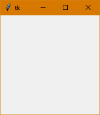
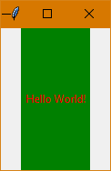
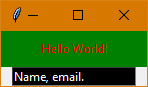
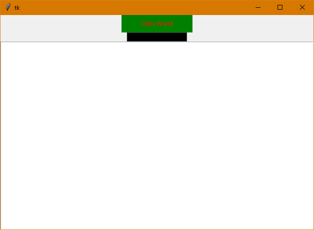
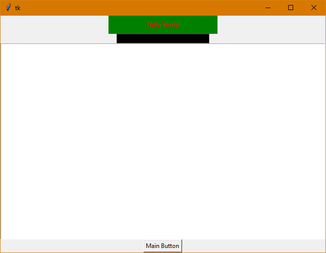
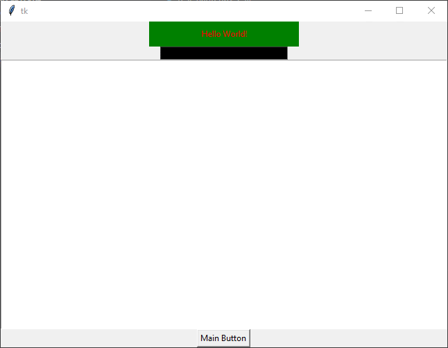

## Creating a GUI using Tkinter in Python

Tkinter is the native GUI framework that comes bundled with the standard Python library. There are numerous other [Python GUI frameworks](https://wiki.python.org/moin/GuiProgramming), however Tkinter is the only one that comes bundled by default. Tkinter has some upper hand on the other frameworks, it is stable and offers cross-platform support. 

This enables developers to quickly develop python applications using Tkinter that will work on Windows, macOS, and Linux. Another benefit is that the visual elements created by Tkinter are rendered using the operating system’s native elements. This ensures that the application is rendered like it belongs to the platform, where it runs.

Tkinter is not without its flaws, the GUIs built using Tkinter appear outdated in comparison to other more modern GUIs. If you’re looking to build attractive applications with a modern look, then Tkinter may not be the best option for you. 

On the other hand, Tkinter is lightweight and pretty simple to use. It requires no installation and is less of a headache to run as compared to other GUI frameworks. These properties make Tkinter a solid option for when a robust, cross-platform supporting application is required without worrying about modern aesthetics. 

In this tutorial, you’ll be going through the following topics: 


*   Basics of Tkinter 
*   Tkinter Widgets
*   Tkinter Events

By the end of this tutorial, you will have mastered Tkinter and will be able to efficiently use and position its widgets. You can test your skills by trying to build your own calculator using Tkinter. 

Let’s get down to it and start with creating an empty window. 


### A Basic Tkinter Window 

Every Tkinter application starts with a window, which is the foundation for each GUI. Windows are containers that contain all of the Tkinter widgets. These widgets are also known as GUI elements and include buttons, text boxes, labels, and etc. 

Creating a window is simple, just create a python file and copy the following code in it. The code is explained ahead and creates an empty Tkinter window. 


```
import tkinter as tk

window = tk.Tk()

window.mainloop()
```


The first line of the code imports the _tkinter_ module that comes integrated with the default version of Python installation. In the second line, we are simply creating an instance of tkinter and assigning it to the variable _window_.

If you don’t include the _window.mainloop() _at the end of the python file then nothing will appear. The _mainloop()_ starts the Tkinter event loop, which tells the application to listen for events like button clicks, key presses and closing of windows. 

Run the code and you’ll get an output like: 





Fig 1: Tkinter Window on Windows 10

Tkinters windows are styled differently on different operating systems. The above given output is generated when the Tkinter window is generated on Windows 10. 

It is important to note that you should not name the python file _tkinter.py_ as this will clash with the Tkinter module that you are trying to import. You can read more about this issue [here](https://www.sololearn.com/Discuss/1628683/solved-attributeerror-module-tkinter-has-no-attribute-tk).  


### Tkinter Widgets 

Creating an empty window is not very useful, you need widgets to add some purpose to the window. Some of the main widgets supported by Tkiner are: 


<table>
  <tr>
   <td>Widget
   </td>
   <td>Description
   </td>
  </tr>
  <tr>
   <td>Entry
   </td>
   <td>An input type that accepts a single line of text
   </td>
  </tr>
  <tr>
   <td>Text
   </td>
   <td>An input type that accepts multiple line of text
   </td>
  </tr>
  <tr>
   <td>Button
   </td>
   <td>A button input that has a label and a click event
   </td>
  </tr>
  <tr>
   <td>Label
   </td>
   <td>Used to display text in the window
   </td>
  </tr>
  <tr>
   <td>Frame
   </td>
   <td>Used to group related widgets 
   </td>
  </tr>
</table>


In the upcoming section, the functionality of each widget, except for frame will be highlighted one by one. These are just some of the main widgets of Tkinter, there are many more widgets that you can check out [here](https://tkdocs.com/tutorial/widgets.html), and some more advanced widgets [here](https://tkdocs.com/tutorial/morewidgets.html). Let’s see how a label works in Tkinter. 


#### Label in Tkinter

Label is one of the main and most simplest widgets of Tkinter. It is used for displaying static text on your Tkinter application. The label text is uneditable and is there just for the purpose of display. Adding a label is pretty simple, extending the code example given above, just add these lines: 


```
import tkinter as tk


window = tk.Tk()

lbl_label = tk.Label(text="Hello World!") 
lbl_label.pack()

window.mainloop()
```


Running this code will provide the following output: 


Fig 2: Label using Tkinter Widget

The output is far from ideal, it’ll be explained why this is in just a moment. In the code above, the variable _label_ initializes a Tkinter label variable and is attached to the window by calling the _pack() _method. 

You can also change the background and text color. The height and the width of the label can be adjusted as well. To change the colors and configure the height and width, simply update the code as follows: 


```
lbl_label = tk.Label(
    text="Hello World!",
    background="green",
    foreground="red",
    width="10",
    height="10"
)
```


Running the code will yield the following output: 





Fig 3: Configuring Tkinter Label Widget

You may notice that the label box is not square, despite the fact that the width and height have been set equal. This is because the length is measured by text units. The horizontal length is measured by the width of 0 (number zero) in the default system font and similarly, the vertical text unit length is determined by the height of the character 0. 

Now let’s see how you can get user input in Tkinter applications. 


#### Entry in Tkinter 

The entry widget allows you to get user input from your Tkinter based application. The user input can be a name, an email address or some other information. You can create and configure an entry widget just like a label widget, as shown in the following code: 


```
import tkinter as tk


window = tk.Tk()

lbl_label = tk.Label(
    text="Hello World!",
    background="green",
    foreground="red",
    width="20",
    height="2"
)

ent_entry = tk.Entry(
    bg="black",
    fg="white",
    width="20",
)

lbl_label.pack()
ent_entry.pack()

window.mainloop()
```


Running the code will yield the following output: 





Fig 4: Configuring Tkinter Entry Widget

You can read the input inserted by the user by using the _get()_ method. A practical example of this method will be shown in the button section. 


#### Text in Tkinter

Entry widget is good if you’re looking for a single line of input. If a response requires multiple lines then you can use the text widget of Tkinter. It supports multiple lines, where each line is separated by a newline character ‘\n’. 

You can create a text widget by adding the following code block in the code shown in the entry widget section: 


```
txt_text = tk.Text()
txt_text.pack()
```


Running the code after adding the code above will yield the following output: 





Fig 4: Configuring Tkinter Text Widget


#### Button in Tkinter

If you want your Tkinter application to serve any meaningful purpose, you will need to add buttons that perform some operation when they are clicked. Adding a button is pretty straightforward and similar to how we added the other widgets. You can add a simple button by adding the following code block: 


```
btn_main = tk.Button(
    master=window,
    text="Main Button"
)
btn_main.pack()
```


Running the code will yield the following output: 




Fig 5: Adding a Button 

Now that there’s a button, we can do some serious action. The button generates an event that can be used for changing elements or performing any other action. 


#### Working With Events 

For the purpose of this tutorial, functions will be kept simple. So, whenever the _Main Button _is clicked, whatever the user inputs in the entry widget, will be pasted in the text and label widgets. 

The code is edited as follows to get achieve what has been described above: 


```
import tkinter as tk


def copyText(text):
    if(str(text)):
        textVar.set(text)
        txt_text.insert(tk.END, text)

window = tk.Tk()

textVar = tk.StringVar()
textVar.set("Hello World!")

lbl_label = tk.Label(
    textvariable=textVar,
    background="green",
    foreground="red",
    width="30",
    height="2"
)

ent_entry = tk.Entry(
    bg="black",
    fg="white",
    width="30",
)

txt_text = tk.Text()

btn_main = tk.Button(
    master=window,
    text="Main Button",
    command = lambda: copyText(ent_entry.get())
)

lbl_label.pack()
ent_entry.pack()
txt_text.pack()
btn_main.pack()

window.mainloop()
```


In the code mentioned above, the _copyText()_ method has been introduced, which copies the text of the entry widget to the label and the text widgets. To change the text of the label, we introduced a _stringVar_ and instead of setting _text _of label, we set the _textvariable_ to the _stringVar_. 

Moreover, using the _command_ statement, we set the button to call the _copyText()_ method whenever it is clicked. The entry widget’s text is passed to the method. 

In the _copyText()_ method, the first step is to check whether the entry widget is an empty string. Python makes it simple to do this as an empty string is considered a boolean false in Python. After checking for the empty string, the value of the entry widget is copied to the _stringVar_ and the text widget. 

The text has been inserted at the end of the text widget by setting its position as _tk.END_. It can be set to a particular index as well by replacing it with “1.0”, where ‘1’ is the line number and ‘0’ is the character. 

Executing the code will yield the following output: 




Fig 6: Tkinter Demo


### Conclusion

Working with Python is fun and simple, it allows you to build cool applications pretty easily. Learning Tkinter allows you to build GUI with your cool Python applications. It’s simple, supports cross-platform and you can build all sorts of applications with it. This is just a basic guide to Tkinter, there’s a whole lot more to it. Learning about geometry managers should be your next step to improve your Tkinter skills. 

Aside from Tkinter, there are a number of other GUI libraries that you can try out for more stylish Python based applications. With the culmination of this tutorial, you should have a basic understanding of Tkinter and how to use buttons to call functions, paving way for further exploration.