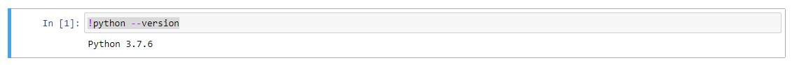

# How to Use the Pip Python Package Manager

Currently, the most popular package manager in Python is Pip, which was introduced after Python 2.7.9. Before Pip, the predominant tool for package management was disutils or its third-party extension, easy_install.

Let’s take a look at all of these one by one and start with explaining what a package is here. In Python, a package is defined as a module that contains other modules or packages. These are the packages you import in your Python code. However, these are not the packages that are being discussed here. 

The packages being mentioned here are the Distribution Packages, which are versioned archive files that contain modules, packages and other files that are important for the distribution of a particular release. 

These archive files are what the users and you download when you install a package using Pip or any of the other package managers. Creating distributions is how you allow users to use your Python projects. 

In this tutorial, you’ll first learn about the tools that are available to create Python distributions. Then you’ll learn about the tools you can use to install these distributions. In short, you’ll learn everything about maintaining Python packages that you’ll come across while working as a Data Scientist. 

To start off this tutorial, you will begin with installing Python on your system, then you will learn about Python Package Index and discover more about disutils and how you can use it to register and upload your packages. Next up, you will learn about Setuptools and Easy Install, which is a third-party application that uses Setuptools. 

You will finally learn about Pip and finally, a little bit about Conda, which comes pre-installed with Anaconda. Conda is much more powerful than Pip since it supports environment and package management, allowing you to create and delete environments. You can learn about how to install Anaconda from here.


## Check for Python  

Before proceeding with package management. The first step is to check whether you have Python installed on your system. Checking this is easy but depends on how you have installed Python. 

If you installed Anaconda on Windows, then search for `Anaconda Prompt` in the Windows search and open the command prompt. In there, just type: 

```python

python --version

```

If you had installed and configured everything correctly, you should get the version of Python installed as output: 

```python

Python 3.7.6

```

Otherwise, if you’re running the command on a command prompt or terminal without installing Python then you’ll get something like: 

```python

Traceback (most recent call last):
  File "<stdin>", line 1, in <module>
NameError: name 'python' is not defined

```

If you’re using an interactive notebook like Jupyter to use Python then you can use the same command with an exclamation mark at the start to check the version of Python installed on your system. 

```python

!python --version

```

You’ll get the version of Python installed as an output, similar to how it ran on the anaconda prompt. The figure one shows the output in case of a Jupyter Notebook.





Fig 1: Jupyter Notebook Output


## Python Package Index (PyPi)

The Python Package Index (PyPi) is basically a huge third-party repository for Python packages. It is also known as the Cheese Shop and holds packages in the form of archives called sdists (source distributions) or alternatively in the form of precompiled Wheels. 

PyPi allows you to version your Python package distribution, allowing you to update the repository as much as you would like. Anytime you update the metadata, a new version is updated on the PyPi repository. 

The end user can search for relevant packages via keywords or the metadata of the packages. Thus, the PyPi repository acts like an index, which stores more than 113,000 Python packages. 

PyPi is the repository that Pip searches through when you try to install a package using Pip or easy_install. It is an efficient distribution channel that even a novice developer can use to share their Python projects.


## Disutils

Disutils is the standard tool for packaging in Python, it was developed by the core team and is included in standard Python libraries. It has two main commands for packaging and uploading data to PyPi. 

The `register` command is used for sending metadata to PyPi while the `upload` command is used for uploading the submitted distribution files. 

This tutorial will not be getting into details of how to package your Python project and upload it on PyPi. If you want to learn about how you can upload your Python project using disutils, read the official guide from [here](https://docs.python.org/3.3/distutils/packageindex.html).


## Setuptools

While disutils allows you to package your Python projects, it only offers very limited features. Disutils was built by the Python core team and only implements the core standards and the minimal necessary compilation. 

For more advanced and useful features, there is setuptools, which offers extended compiler, package format and other support to effectively package Python projects. Since setuptools is a third party package, it does not come pre-installed with a Python library. 

This tutorial will not discuss how to package Python projects with setuptools. To learn about using setuptools, you can follow this [developers guide](https://setuptools.readthedocs.io/en/latest/setuptools.html#developer-s-guide) to using setuptools. The guide mentions all the important commands and keywords you will need to know to start using setuptools. 


### Easy Install

Before there was Pip, there was easy install, which was also a package manager for Python. Easy install allows for automatic downloads, builds, installs and updates for Python packages. 

Using easy install was quite similar to Pip, you had to provide the URL, filename or PyPi project name to get the designated Python package. After you have entered the appropriate package name, easy install will try to get the latest available version of Python package for you. 

Easy install recognizes files with extensions of .zip, .tar.bz2, .tar.gz and a few others. It also supports the already built .egg and .win2.exe distributions that are built using disutils.

Let’s highlight some of the basic commands of easy install. You can install a Python package by using the following easy install command: 

```python

easy_install package_name

```

This is how you can install a Python package if you know its URL and package name: 

```python

easy_install -f URL package_name

```

 Upgrading an installed package is pretty simple with easy install: 

```python

easy_install --upgrade package_name

```

If you want to install a specific version of the package, you can do so by including the version name: 

```python

easy_install ‘package_name==1.3.2’

```

You can revert back to a previous version of a package by entering the following command: 

```python

easy_install package_name===1.2

```

To uninstall a package, you use the following command to remove all references to that package: 

```python

easy_install -m package_name

```

After running the command, you can manually remove the .egg and any other associated files from your system. 

To learn more about easy install and how you can easily manage your Python packages, head to the official documentation [here](https://setuptools.readthedocs.io/en/latest/easy_install.html).


## Pip

Pip installs packages or Pip as it is commonly known is the most well-known Python package manager. It enables for convenient installation and maintenance of Python packages found in the Python Package Index (PyPi). 

Python versions later than 2.7.9 come with a pre-installed pip. It was built on setuptools as well and was released in 2008 as a direct replacement of easy installs. One notable feature of pip when it was released was that it did not install packages as eggs, rather installed them through requirement files, allowing users to conveniently replicate environments. You can read more about the difference between pip and easy tools [here](https://packaging.python.org/discussions/pip-vs-easy-install/).

Since pip was built to replace easy tools, most of the pip commands are very similar to easy installs. Let’s check some of the most common pip commands. 

Here’s how you can install the latest version of a package using pip: 

```python

pip install package_name

```

If you want to install a specific version of the package, you can do so by including the version name: 

```python

pip install ‘package_name==1.3.2’

```

You can easily upgrade a package using pip: 

```python

pip install --upgrade package_name

```

To uninstall a package:

```python

pip uninstall package_name

```

A great feature of pip is that it supports the installation of packages by using a `requirements.txt` file. The text files include a list of packages and their version numbers required to run the project. 

Here’s a sample `requirements.txt` file, which installs some machine learning related packages: 

```python

tensorflow==1.7

scipy

scikit-learn

opencv-python

```

Here’s how you can run the requirements file to install all of these packages: 

```python

pip install -r requirements.txt

```

To learn more about requirements files, read [this](https://pip.pypa.io/en/latest/user_guide/#requirements-files) official guide.


### Conda

Conda is included when you install Anaconda, which is a free and open source distribution of Python. Conda allows you to install packages and manage environments as well. It comes with a default environment `base`, which is activated whenever you use Python in Anaconda. 

It is advised that you do not use the base environment and create your own to isolate your Python projects. This tutorial is just giving an honorary mention to Conda, as it is the leading Python package manager. There is a lot more to it and you can learn it from the official Conda [tutorial](https://conda.io/docs/user-guide/getting-started.html#managing-environments).


## Conclusion

Whether you are creating a simple Python project for your class or leading a huge open source project, you need package management to distribute your code to the end-users. With this tutorial, you now have enough information to understand the terminologies used in the Python package management domain and figure out how you can distribute your Python projects. 