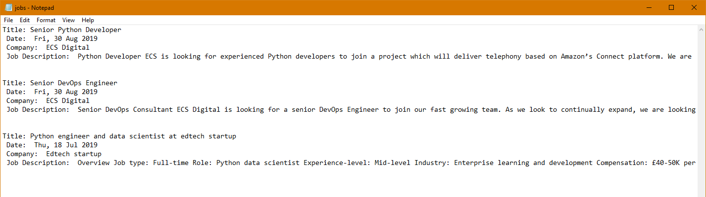

# Scraping Static Websites using Beautiful Soup 

The internet is brimming with data about everything you can think of. Most of it exists on websites on public domains that you can access through your web browsers. To harness this data, you need to learn the valuable skill of web scraping. 

This tutorial will teach you about the basics of web scraping with a practical example. In this tutorial, the job postings from the [PythonJobs](https://pythonjobs.github.io/) website will be extracted and parsed to provide some meaningful information. 

Here’s the agenda of this tutorial: 

*   What is web scraping? 
*   What is an API? 
*   Difference between static and dynamic websites
*   How to perform web scraping using BeautifulSoup library

By the end of this tutorial, you will be able to static website and start your career as a web scraper.


## Web Scraping 

Suppose that you are looking for a new job. This job has to be related to development and has to be in New York, USA. Since the odds of you finding your dream job on day one of your search are slim, therefore, you probably have to invest time on a regular basis to search for the jobs. 

This approach will take your time and resources and it is not very productive. Let’s be real, who likes searching for jobs? It’s boring and tiring. 

You can automate this part of your job hunt by creating a custom web scraper that scrapes the data from your favorite job listing website and returns them, without breaking a sweat. Automated web scraping will speed up your data collection process, increase your reach to new jobs and save your time, allowing you to invest it elsewhere. 

Data is almost constantly added onto websites on the internet. [According ](https://www.weforum.org/agenda/2019/04/how-much-data-is-generated-each-day-cf4bddf29f/)to the World Economic Forum, by 2025, 463 exabytes of data will be created each day globally. 1 exabyte is equal to 1 billion [gigabyte](https://en.wikipedia.org/wiki/Exabyte). A good movie has a size of about 1 to 2 GB. So just imagine the size of the internet and how inefficient it is to manually skim through the internet. 


### Challenges of Web Scraping 

Building websites is complicated, it involves the use of multiple technologies that work together to provide seamless user experience. It is constantly changing and growing. This leads to a few challenges when you’re trying to build automated scripts to scrape websites.

The main challenge is the **variety **of the websites available there. Websites do not follow a specific template and despite having a general structure, each website is a unique creation. Therefore, each website requires a customized scraper that deals with the extraction of the required information. 

The next challenge is **change**. Websites are constantly changing, constantly adding new features or updating old ones. What this means for a web scraper is that the code you write today, may not work in a month from now. However, the changes are mostly incremental, so you can update your scraper quickly to make it work with the updates. 


## What are APIs

Application Programming Interfaces (API) are the alternative to web scraping as some websites will themselves provide you with programmatic access to their data. APIs tend to simplify the work of scraping data and make its retrieval more consistent and reliable by providing a method that you can use to extract data. 

APIs are more reliable because they are immune to visual updates on the website because an update on the website does not mean that the structure of the data has been changed. Using APIs, you can avoid parsing complex HTML and get results in the form of a JSON or XML file. 

This does not mean that APIs do not change. If the structure of the data changes or the provider is releasing a new feature then they may change the API calls for various reasons. Moreover, working with APIs can be a challenge without proper documentation. 

You should check whether the website or the service you are trying to scrap provides an API. As it may be easier and more reliable to use an API. Teaching APIs is out of this tutorial’s domain, so let’s get to how you can scrape information from the feed of [PythonJobs](https://pythonjobs.github.io/).


## Scraping from PythonJobs

In this tutorial, you will be building a web scraper by using Python and the BeautifulSoup python library, to extract listings from PythonJobs. The web scraper will parse the extracted HTML from PythonJobs to gather the relevant information, filtered using specific words. 

Using the technique that will be used in this tutorial, you can scrape any static website out there. 

### Getting Ready

Before getting started with parsing, you need to install the relevant Python packages. For scraping websites, you require two packages namely, _requests_ and _BeautifulSoup_. The _requests_ package helps you get the HTML from the provided URL. Whereas, _BeautifulSoup_ helps in parsing the HTML to extract meaningful information. 

Install _requests_ with the help of the following command: 


```
PS C:\Users\Python\pythonJobs> pip install requests
```


Install _BeautifulSoup _with the help of the following command: 


```
PS C:\Users\Python\pythonJobs> pip install beautifulsoup4
```


Now that the necessary packages are installed, you can start the process of parsing websites using Python. 


### Getting the HTML 

The first step towards scraping websites is getting the raw HTML data from the relevant website. This tutorial is focused on scraping from PythonJobs and the following code gets the HTML from the website and writes it in an _html.txt _file. 


```
import requests

URL = 'https://pythonjobs.github.io/'

page = requests.get(URL)

htmlfile = open('html.txt','w+')
htmlfile.write(str(page.content))

htmlfile.close()
```


You can view the extracted HTML by checking the newly formed text file. However, the text file will have a lot of gibberish because it will contain all of the HTML, with a lot of extra tags and data. 


### Knowing What to Extract

Before starting on the parsing process, you need to understand the structure of the HTML you are working with. You need to know what to parse and figure out which tags hold the information that you require. 

The following HTML has been extracted from the PythonJobs website, it describes the structure of one job posting. 


```
<div class="job" data-order="3" data-slug="ecs_python_developer_london" data-tags="python,aws,lambda,connect,typescript,react,s3,kenesis">
    <a class="go_button" href="/jobs/ecs_python_developer_london.html"> Read more <i class="i-right"></i> </a>

    <h1><a href="/jobs/ecs_python_developer_london.html">Senior Python Developer</a></h1>
    <span class="info"><i class="i-globe"></i> Bermondsey, London, England</span>
    <span class="info"><i class="i-calendar"></i> Fri, 30 Aug 2019</span>
    <span class="info"><i class="i-chair"></i> permanent</span>
    <span class="info"><i class="i-company"></i> ECS Digital</span>

    <p class="detail">
        Python&nbsp;Developer ECS is looking for experienced Python developers to join a project which will deliver telephony based on Amazon's Connect platform. We are building the next generation of contact centre based on AWS...
    </p>
    <div class="search_match"></div>
</div>
```


You can read the HTML directly from the website with the help of developer tools, which can be accessed by pressing _F12_, if you’re using Google Chrome browser. The HTML may be unstructured while being accessed with the help of developer tools, you can use an [HTML Formatter](https://webformatter.com/html) to format the HTML into nicely structured code.

For this tutorial, we will be focused on retrieving jobs for Python developers, available in the UK. Reading the HTML, it is evident that the main &lt;div> with a class “job” and the word “python” in the attribute of data-tags correspond to a job of a python developer. 

The condition for a Python job has been determined, now you can figure out how to determine the place of the job. From the HTML, it is evident that the &lt;span> with the child &lt;i> that has class “i-globe” contains the location of the job. You can extract the text and match it using string comparison. 

Now that the conditions have been defined, let’s translate all of this into code by using the beautifulsoup package.


### Extraction using BeautifulSoup

BeautifulSoup is a well documentation package that has well-defined methods, which will help you scrap websites very easily. Extending the Python code defined earlier, beautifulsoup is added to parse the extracted HTML. 


```
import requests
from bs4 import BeautifulSoup

URL = 'https://pythonjobs.github.io/'

page = requests.get(URL)

soup = BeautifulSoup(page.content, 'html.parser')

pythonJobs = soup.select('div[data-tags*="python"][class="job"]')

for job in pythonJobs:
    print(job.prettify())
```


In the code, firstly, the beautifulsoup package is imported and its object _soup_ is created that reads the HTML extracted from the PythonJobs. A parser has to be defined with every beautifulsoup object, in the second argument since the package can parse XML as well. 

Using _soup_ object, all the &lt;div> tags having a class of “job” and containing the word “python” in their attribute “data-tags” are selected and stored in _pythonJobs_, this has been done via [CSS selectors](https://www.w3schools.com/cssref/css_selectors.asp). Consequently, the _pythonJobs _element is iterated one by one and each job is printed. The method _prettify() _formats the HTML to make it easier for a human to read. 

Running the code will print out all the python related job postings from the PythonJobs website. Now let’s filter them based on their locations and store them in a text file. 

To filter the jobs based on their location let’s extract the &lt;i> tag with the class “i-globe” and then get their parents. It can easily be checked if the job is in the UK by comparing the text, like has been done in the code ahead. 


```
for job in pythonJobs:
    iGlobe = job.find("i", class_="i-globe")
    location = iGlobe.parent


    locationText = location.get_text().upper()
    matches = ['UK','ENGLAND','U.K.']


    if any(match in locationText for match in matches):
        print(locationText)
```


Now that it is verified that the job meets our criteria, you can extract the required information under the if condition. 


```
    if any(match in locationText for match in matches):
        title = job.select_one('h1 > a')
        titleText = title.get_text()

        datePosted = job.find("i", class_="i-calendar")
        datePosted = datePosted.parent
        datePostedText = datePosted.get_text()

        company = job.find("i", class_="i-company")
        company = company.parent
        companyText = company.get_text()

        description = job.find("p", class_="detail")
```


By using the methods described earlier, you can find the title, the date at which the job was posted, the name of the company and the job description. Finally, you can store all this information in a structured manner in a text file. 


```
        jobFile = open("jobs.txt", 'a+')
        jobFile.write("Title: "+titleText+"\n Date: "+datePostedText+"\n Company: "+companyText+"\n Job Description: "+description.get_text()+"\n\n\n")
```


This should produce the text file shown in the figure 1:



Fig 1: Storing jobs in a text file


## Conclusion

Data scraping is not as simple as it sounds but with the help of packages like BeautifulSoup and Scrapy, you can do a lot of cool things. After the completion of this tutorial, you will be able to scrape data from static websites quite easily. 

BeautifulSoup is packed with a lot more features, read their [documentation](https://www.crummy.com/software/BeautifulSoup/bs4/doc/#) to learn what more you can do with it. The packages caters to most of the scraping requirements and due to its comprehensive documentation and a strong community, it is the package to go with. 
