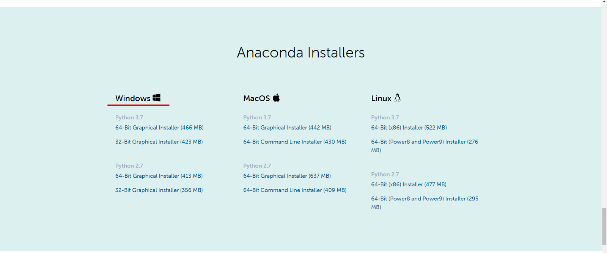
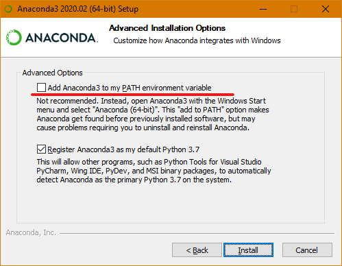
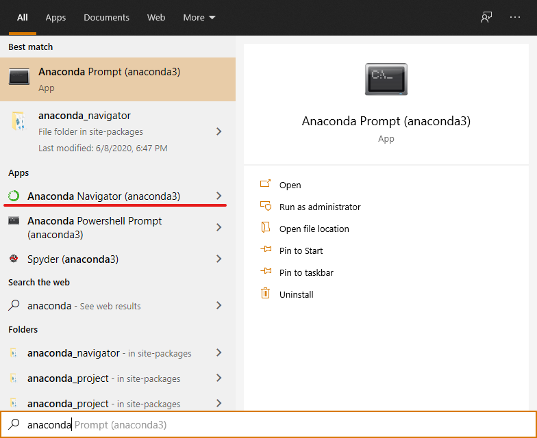
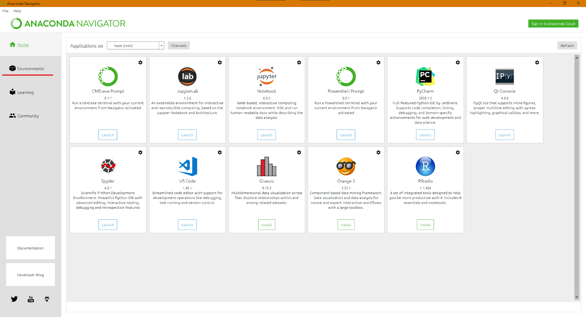
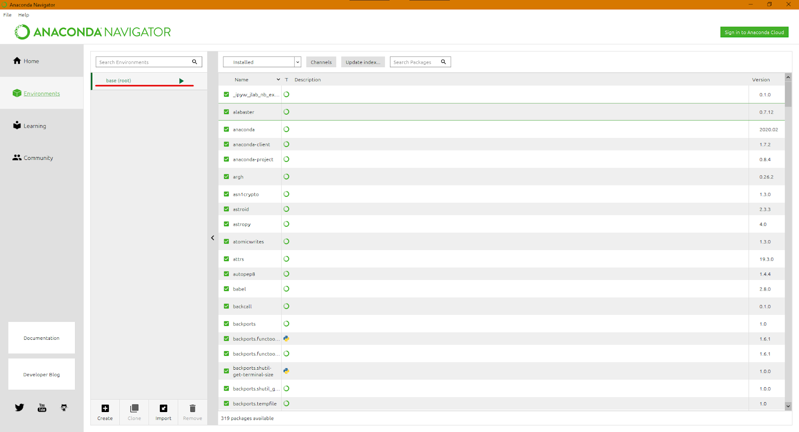
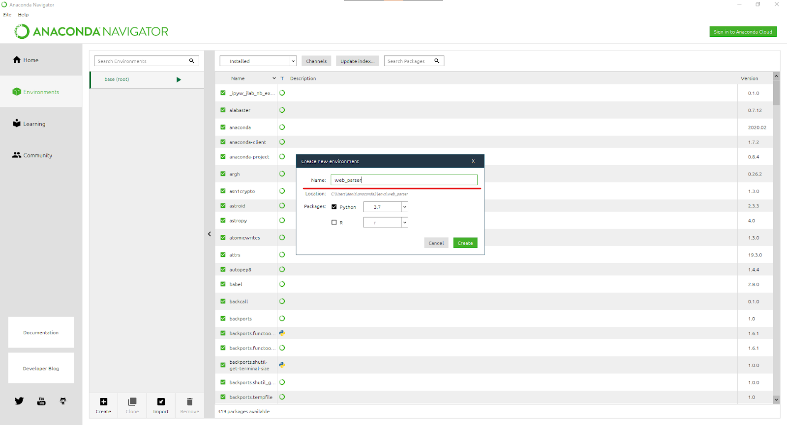
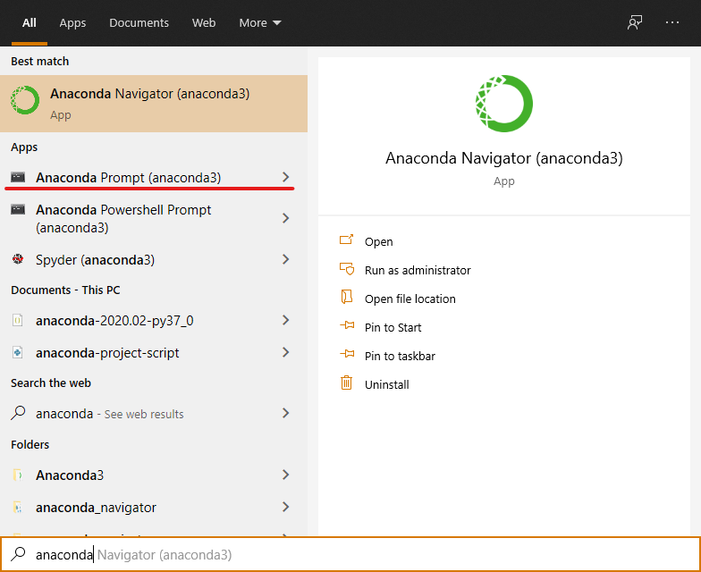
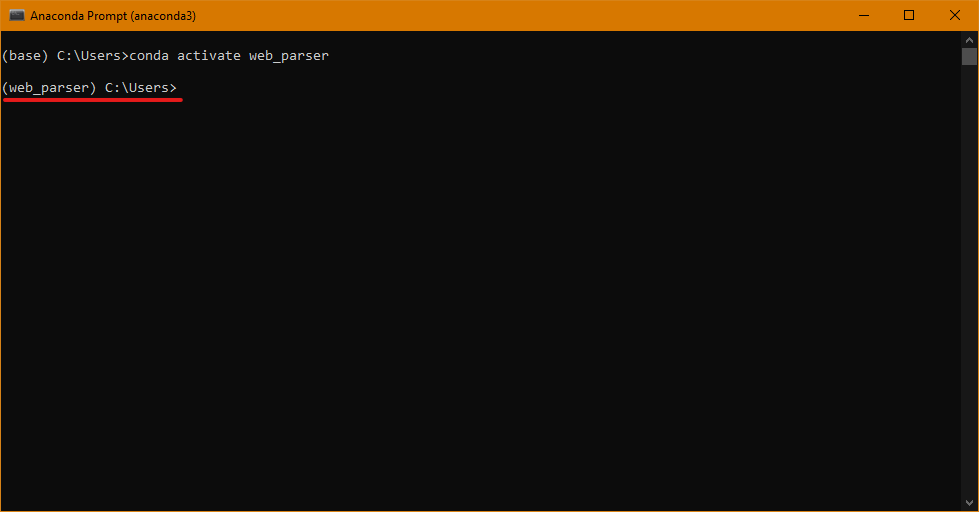
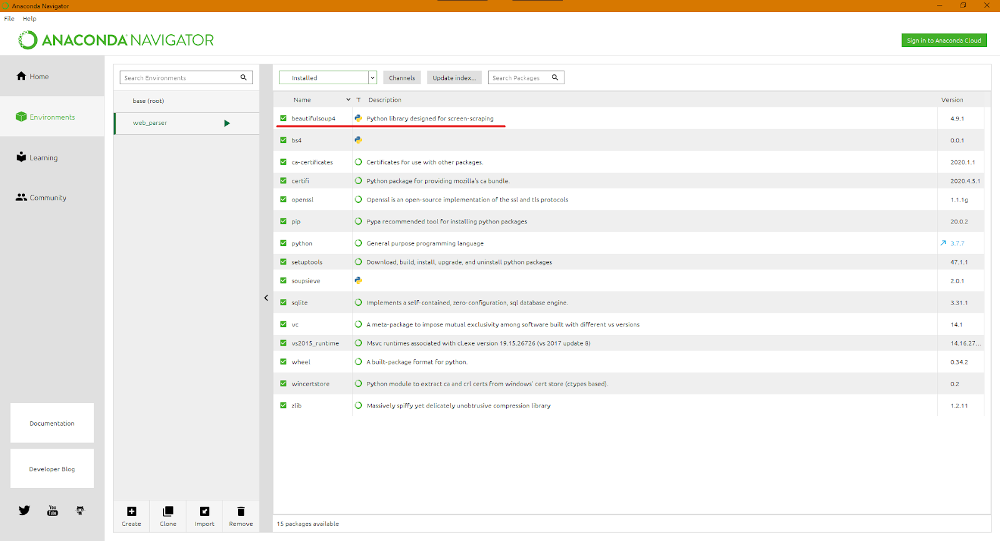

# How to Install Anaconda on Windows

It is advisable to use virtual environments while working with Python. A virtual environment is a way to isolate projects into different environments to reduce clashes between dependencies, improve project structure and remove extra packages. 

This not only reduces the size of your Python projects but also improves the readability, maintainability and overall durability by ensuring that only the required packages are maintained. 

Now, you can manage your packages and create new environments programmatically after installing Python on your system. Or, you can simply install [Anaconda](https://www.anaconda.com/) for Python. 

Anaconda allows you to supercharge your data science projects by providing you the power to manage packages and environments, while also installing the latest version of Python on your system. 

Moreover, many of the most commonly used and famous packages like numpy, scikit-learn, scipy and pandas come pre-installed with Anaconda. If you require additional packages to run your project, simply install them via the Anaconda GUI, conda or pip. 

Anaconda handles the package management, managing dependencies between different packages and also allows you to switch between Python 2 and 3. If you’re a beginner at Python, then you’ll most definitely want to use Jupyter Notebooks for your Python projects and practice. 

You can easily install Jupyter Notebooks via the Anaconda GUI, in fact, it is the recommended way to install Jupyter. 

In this brief tutorial, you will learn how to: 


*   Install Anaconda
*   Creating a new environment
*   Activating the newly created environment

Let’s start with the installation of Anaconda. 


## Installing Anaconda

You can easily install Anaconda by heading to their [website](https://www.anaconda.com/) and downloading the free individual [version](https://www.anaconda.com/products/individual). If you’re a team or an enterprise, then you’ll have to check out the other paid-for versions. 


### Downloading the installer

Only the individual version is going to be discussed here. After opening the relevant link, head down to the “Anaconda Installers” section and download the appropriate package.





Fig 1: Anaconda Installers

In this tutorial, we’ll be downloading the Python 3.7 64-bit installer for Windows. You can choose whichever installer is appropriate for your system. 


### Running it

After the download is complete, run the installer, which will start the setup. 


Fig 2: Running the setup


### Add to path? 

Go through the setup, install only for yourself or for all users of the system and then you’ll reach the screen of `Advanced Installation Options`. It is important here that you leave the `Add to PATH variable` checkbox unticked. 





Fig 3: Running the setup

Leaving it unticked is important, as adding the Anaconda installation to your PATH variable may cause problems later on. 

Now let the installation run, it should complete shortly. After it is done, close the setup and you have successfully installed Anaconda on your system. 


## Running Anaconda and Viewing Environments

If you’re running on Windows, press your windows button and search for `Anaconda`, it will show you the Anaconda Navigator application. 




Fig 4: Starting Anaconda

Open the Anaconda Navigator to enter the Anaconda GUI from where you can view the most relevant applications, checkout environments and read documentations and tutorials. 

Enter the environments management console by clicking on the environments button on the left bar. 





Fig 5: Anaconda GUI and Environments Button

Now you will be able to check out all the environments that are currently on your Python distribution. Since you haven’t configured any, there will only be the default `base` environment. 





Fig 6: Anaconda Environments


### Creating a New Environment

You can see which packages are installed in the default `base` environment. Now suppose you are [creating a Python web parser](https://nickmccullum.com/beautiful-soup-web-scraper-python/) by using the beautifulsoup library. You should create a new environment for this project before starting, to isolate it from irrelevant packages.

Creating a new environment is simple, just press the `create` button at the bottom and give it a name and select the required Python version and press `create`. 





Fig 7: Creating a New Environment

It will take a few moments to create the new environment, after which, you can view the environment by selecting it from the list. 

After selecting it, you can view all of the packages that come pre-installed in any newly formed environment. 


### Activate and install packages

Now that your new environment is ready, you can activate it and install new packages onto it. 

To do this, let’s open the Anaconda Prompt by searching for `Anaconda` in the Windows search bar. It will show you the `Anaconda Prompt` application, open it. 





Fig 8: Running the Anaconda Prompt

Once you run it, you’ll notice it’s just like the Windows command prompt, the only difference is that it will run Python. You can see the currently active environment on the left of each command. 

By default, it will be `base`. Let’s activate the environment we created earlier. You can do it easily by running the command: 


```
(base) C:\Users>conda activate web_parser
```


Once you run this command, it will activate the environment `web_parser. Now you can install the required packages here. You can see the updated environment in figure 7. 





Fig 9: Activating a Custom Environment

Since the intended project is a web scraper, you will install the beautiful soup package. Just run the following command to install it: 


```
(web_parser) C:\Users>pip install bs4
```


Now the beautiful soup library should be installed in your newly created environment and you have taken the first step towards becoming an effective data scientist. 

You can view this updated package in your environment by opening the `Anaconda Navigator` and opening the appropriate environment. You will see that the beautiful soup package is installed there, as visible in figure 8. 





Fig 10: Installed Beautiful Soup


## Conclusion 

With the completion of this tutorial, you have learned how to install Anaconda, manage packages and create new environments. These skills will allow you to effectively manage your Python projects and make you a great data scientist. 

Isolating your projects into different environments is a good approach towards mitigating the risks of clashes in dependencies. You can create as many environments as you’d like, so feel free to generously test them out to discover new things and optimize your development skills. 

 
