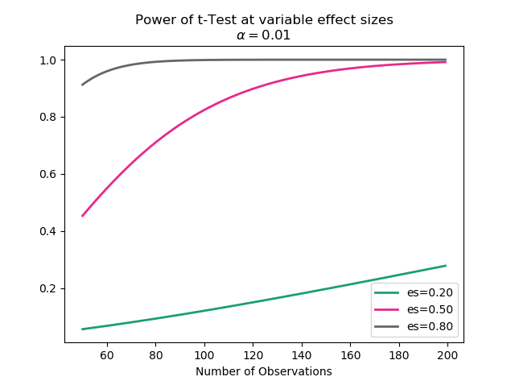

# Statistical Power Analysis in Python: A Step-by-Step Guide

While performing an experiment, you would like to ensure that the power of your experiment is at least 80%. To achieve this, you need to determine the sample size for your experiment that will yield 80% of power. 

Before proceeding to discuss the benefits of power, let’s talk about what power means here and what power analysis is. In terms of statistics, power is the ability to detect the presence of true effect in any experiment. 

Power allows you to comment on the confidence that one might have in the conclusions drawn from the results of an experiment or a study. Power can also be used as a tool to determine the sample size that will be required to detect a true effect in an experiment.

In companies like Netflix and Amazon, tools and techniques like power analysis are used on a regular basis to test out new features, and implement those that bode well with the largest proportions of the userbase. The role of the data scientists in these companies is to use tools like power analysis to study the features and experiments, to ensure that the results are reliable and can be used in the decision making process. 

In this tutorial, you’ll learn about the significance of statistical power and its usage in daily life. By the end of it, you’ll be able to carry out power analysis to determine the sample size of any experiment to determine true effect. 


## Breakdown 

To understand power analysis, you first need to have a firm grasp over the concepts of significance level, Type I/II errors and the effect size. 

Significance level is denoted by the Greek letter alpha (**α**) and describes the probability of rejecting the null hypothesis, when it was actually true. For Pearson Correlation test, the null hypothesis is that there is no correlation between the two variables. Similarly, for Student’s t test, the null hypothesis is that there is no difference between the means of two populations. 

P-value is a metric closely associated with the significance level and relates to the probability of obtaining a result at least as extreme as what is observed in the data. It is the probability of observing the results, provided that the null hypothesis is true. 

The result of an experiment is considered significant if the p-value is smaller than the significance level. The alpha or significance level is specific before the study and its value depends on the kind of experiment and business requirements. 

The p-value is just a probability and the actual results may be different and the test could be wrong. Depending on the p-value, it is possible to make an error in the interpretation of the results. 

There are two types of errors: 


*   **Type I Error: **When a true null hypothesis is rejected, you make a type I error, also known as false positive. 
*   **Type II Error: **When a false null hypothesis is accepted, you make a type II error, also known false negative. 

The last thing that you need to be aware of before proceeding to statistical power analysis is the effect size. It is the quantified magnitude of effect/phenomenon present in a sample size/ population of an experiment. The effect size is usually measured by a specific statistical measure such as Pearson’s correlation or Cohen’s d for the difference in the means of two groups. 


## Statistical Power

Statistical power is the probability that the given experiment correctly rejects the null hypothesis when the alternative hypothesis is true. 

The higher the statistical power, the lower the probability of having a type II error. Consequently, it means that there is a higher chance of detecting an effect when there actually is an effect to measure. 

In reality, results from experiments, which have low statistical power will lead to wrong conclusions and eventually have a negative impact on the decision-making process. Commonly, the statistical power is set at 80% or 0.08, to ensure that the tests or experiments yield accurate and reliable results.


## Power Analysis

The aforementioned concepts all relate to power analysis and are required for conducting it. To reiterate, power analysis is built from the following variables: 


*   Significance Level (**α)**
*   Effect Size
*   Power 
*   Sample Size 

All four of these variables are linked together and changing one of them impacts the other four. Increasing the sample size can make it easier to detect true effects and reducing the significance level will reduce the power. 

Following this relationship, if three of these variables are known then we can determine the fourth unknown variable and this is what power analysis is all about. 

This is useful when an experiment is being designed then the alpha, power and effect size that is relevant for that experiment can be selected and consequently, the sample size that will be needed for such an experiment, be calculated. 

It is also useful when you want to validate the findings of an experiment. By using the given sample size, effect size and significance level to determine the power of the conducted experiment to conclude whether the probability of committing a Type II error is acceptable from the decision-making perspective. 

Aside from these two benefits, power analysis can also be used for sensitivity tests where you can analyze the impact of changing one variable on the rest of the three. The results can be plotted on a graph to aptly explain the behavior of the experiment. 


## Power Analysis using Python

To understand how you can perform power analysis using Python, this tutorial will be carrying out power analysis for the case of the independent two-sample t-test. The statsmodel library of Python contains the required functions for carrying out power analysis for the most commonly used statistical tests. 

To start, let’s determine the sample size needed for an experiment in which a power of 80% is acceptable, with the significance level at 5% and the expected effect size to be of 0.9 and is defined as a large effect size by [Cohen’s d](https://en.wikipedia.org/wiki/Effect_size#Cohen's_d). 

The first thing would be to import the relevant libraries. All are included in the native Python distribution that is shipped with Anaconda,.

```python

import numpy as np

from statsmodels.stats.power import TTestIndPower

import matplotlib.pyplot as plt

```

Then, we write the following code to initialize the variables containing the building blocks of power analysis and then using the functions imported from statsmodels to get the required missing variable, which is the sample size in this case. 

```python

# variables for power analysis

effect_size = 0.7

alpha = 0.05

power = 0.9

p_analysis = TTestIndPower()

sample_size = p_analysis.solve_power(effect_size=effect_size, alpha=alpha, power=power)

print("Required Sample Size: " + str(sample_size))

```

Since the sample size is returned as a float, we convert it to string using `str()` while printing it. Running this code will yield the following output: 

```python

Required Sample Size: 20.386330536162777

```

Taking it slightly further, you can also check out how power will change if other building blocks are changed. In the code below the sample size is increased from 50 to 200 while keeping the significance level constant and the effect size at [0.2, 0.5, 0.8], which are defined as small, medium and large levels by Cohen’s d.

```python

# power vs. number of observations

fig = plt.figure()

fig = TTestIndPower().plot_power(dep_var='nobs',

                                nobs= np.arange(50, 200),

                                effect_size=np.array([0.2, 0.5, 0.8]),

                                alpha=0.01,

                                title='Power of t-Test at variable effect sizes\n' + r'$\alpha = 0.01$')

plt.show()

```

Running this code will print out the following graph: 




From the graph, it can be deduced that increasing the sample size and effect size can increase the power of the experiment. The bigger the effect and sample sizes, while keeping other variables constant, the larger will be power of the experiment. 


## Conclusion 

In this tutorial, the basics of power analysis and how it can be used to determine the missing variables have been discussed. There is a lot more to statistical power analysis and you can take your graphs into 3-D to provide even further details regarding the impact of changing the building blocks on the power of the experiment.

As a data scientist, learning about statistical power analysis is imperative as it is extensively used in the industry for building robust A/B tests and providing quality information to the administration for a better decision-making process.