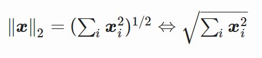
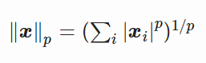

# How to Calculate the Norm of a Vector in Python

The norm of a vector allows you to gauge the distance or the magnitude of a vector. It is pretty similar to how you can calculate the distance between two real scalar values **_a_**, **_b_** by using the formula **_|a-b|_**. If you have a vector with norm or length one then that is simply a scalar. 

Norms are regularly used in regularization methods and are used to evaluate the errors of a model. The latter is evaluated by calculating the actual output of a neural network versus what is expected as the actual outcome or value. 

If given a vector space **_R<sup>n</sup>,_** a vector norm is defined as a function: **_f:R<sup>n</sup>→R_**. The norms are represented by the double-bar notation and the function helps map the vector to a positive value.

The norm of a vector cannot be negative and if you consider it as the length of the vector, it would be easier to understand why it cannot be negative. 


## Characteristics of Norm 

Vector norms are any function that fulfil the following criteria: 


*   Norms are non-negative values. 
*   Norms are 0 only if the vector itself is a zero vector. 
*   Norms respect the triangle inequity, which is:**_||u+v||≤ ||u||+||v||_**
*   A scalar multiplied to the norm of a vector is equal to the absolute value of this scalar multiplied by the norm of the vector. 

There are different functions used to calculate the norm of a vector, here we will be discussing the most commonly occurring vector norms of 1, 2 and **_p_** norms. 


## Vector Norms in Python

To understand the implementation of vector norms in Python, we will be creating a simple Python script and explaining it step by step. The first step is to create an array filled with random digits by using the numpy’s `randint()` function.

```python

import numpy as np

def main():

   x = np.random.randint(-5, 10, 10)

   print(x)

if __name__ == "__main__":

   main()

```

Here, you have created an array of size 10 that will have any random values between -5 and 10. This random array can be understood as a vector and we can find out its norm by using the following code block: 

```python

import numpy as np

def main():

   x = np.random.randint(-5, 10, 10)

   print(x)

   norm = 0

   for i in x:

       norm += np.abs(i)

   print(norm)

if __name__ == "__main__":

   main()

```

If you run this code, it will create a random array, print it out and then calculate its norm and print it. While running this code, it yielded the following output: 

```python

[ 5  5  3  6  0  5 -5 -2 -3  7]

41

```

What we just calculated using Python is the 1-norm of a vector. To better understand it, consider the following equation, which provides the 1-norm of a vector **_x_**. 

||x||<sub>1</sub>=|x<sub>1</sub>|+|x<sub>2</sub>|+⋯+|x<sub>n</sub>|

The 1-norm is also known as Taxicab norm and is usually denoted by **L<sup>1</sup>**. A more optimized way to calculate the Taxicab norm using Python is given in the following code block: 

```python

new_norm = np.sum(np.abs(x))

print(new_norm)

```

In this code, the only difference is that instead of using the slow for loop, we are using numpy’s inbuilt optimized `sum()` function to iterate through the array and calculate its sum. 


### 2-Norm

The 2-norm of a vector is also known as Euclidean distance or length and is usually denoted by **L<sup>2</sup>**. The 2-norm of a vector **_x_** is defined as:





The calculation of 2-norm is pretty similar to that of 1-norm but you raise the value by the power of two and take the square root at the end. The following block of code performs the 2-Norm by using Python. 

```python

import numpy as np

def main():

   x = np.random.randint(-5, 10, 10)

   print(x)

   new_norm = np.sum(np.abs(x))

   print("1-norm: " + str(new_norm))

   two_norm = 0

   for i in x:

       two_norm += np.abs(i) ** 2

   two_norm = np.sqrt(two_norm)

   print("2-norm: "+str(two_norm))

if __name__ == "__main__":

   main()

```

Running this code, will yield the following output below. However, note that since the array is being randomly produced so the output will be different for you. 

```python

[ 4 -4 -4  7  3 -4  5  7  0  2]

1-norm: 40

2-norm: 14.142135623730951

```

There’s a better way to do it, instead of using the expensive for loop, we can use the following shorter version of the code that uses numpy’s inbuilt function to do the same job. 

```python

new_two_norm = np.sqrt(np.sum(np.power(x, 2)))

print("new-2-form: " + str(new_two_norm))

```

This line of code does the same job as the code block we previously explained, but faster and more neatly. 


### P-Norm 

The third kind of norm that will be discussed here is the p-norm, which is defined as: 





Here, we can set the value of p as 1 or 2 to find the 1-norm and 2-norm of the vector respectively. Similarly, we can set the value of p to any real number, however, the number cannot be less than zero or be complex. 

The following code calculates 1-norm by using the p-norm equation given above. 

```python

pnorm = 0

p = 1

pnorm = np.sum(np.abs(x)**p)**(1/p)

print("1-pnorm: " + str(pnorm))

```

Now let’s try setting the value of p to 5 and for comparison, run the numpy’s inbuilt norm calculation function to the same degree. 

```python

import numpy as np

def main():

   x = np.random.randint(-5, 10, 10)

   print(x)

p = 5

print(np.sum(np.abs(x) ** p) ** (1. / p))

print(np.linalg.norm(x, 5))

if __name__ == "__main__":

   main()

```

Running this code will yield the following output: 

```python

[-5  2  9  7  6  4 -3  0  5  1]

9.81706853194997

9.81706853194997

```

As evident, both functions yield the same result and this is how you can calculate the norm of a vector to any degree by using Python. 


## Conclusion 

In this tutorial, we have just skimmed the surface of calculating norms of vectors by using Python. The topic is too vast to be covered in a single tutorial and to learn more about norms, you can read from [Wikipedia](https://en.wikipedia.org/wiki/Norm_(mathematics)) and other educational sources. 