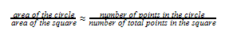
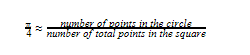
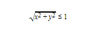
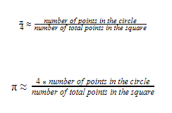
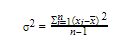

# How to create Monte Carlo Simulations in Python

Monte Carlo method is a technique that is widely used to find numerical solutions to problems using the repetition of random sampling. Its applications can be found in a broad range of fields including quantum mechanics, financial analysis, trend prediction. How Monte Carlo works is that it produces many possible outcomes with respective probabilities for each outcome, including extreme possibilities.

In this tutorial, we will get familiar with the Monte Carlo technique through a simple numerical application; finding the value of Pi (π).

All of us know what Pi is and that its value is approximately 3.14. However, let us refresh our minds with the concept of Pi first. It is imperative that we understand the fundamentals behind it as we are about to determine its value using the Monte Carlo technique.

## What is Pi?
    

We remember the equation to find the circumference of a circle by heart.

c=2πr

  

In the above equation, c and r denote the circumference and radius of the circle respectively. Looking at the equation, in simple terms, we can say that Pi is the ratio between the circumference and diameter of a circle.

Let us also remind ourselves that the area of a circle is calculated as follows as it is really important that we know it when we are finding the value of Pi using the Monte Carlo technique.

A = πr<sup>2</sup>

There are one more terminology and a few concepts we need to cover before we start with any coding. We will look at those in the next sections.

## What is Statistical Sampling?
    

In this tutorial, before we apply Monte Carlo technique, we are to perform some statistical sampling in order for us to gather the required data points to determine the value of Pi. Therefore, let us first understand what statistical sampling is.

Statistical sampling is the process of acquiring observations or data randomly from a distribution. For instance, imagine you are trying to find the average student weight in a school so that you can compare those across states or counties as an indicator of obesity. As we are unable to use standard equations or formulae to get an estimation, we have to manually acquire data and calculate the average. The correct way to do this is to acquire as much data as possible instead of getting the weight of a few students and finding the average based on that.

Therefore, it can be established that the more data we have, the more accurate the outcome will be. Not only this help us to reduce the sampling error, but also will elevate the quality and reliability of the estimations as they represent a wider population. Moreover, the higher the samples are, the lesser its bias will be as the element of randomness is also higher with more samples.

In our tutorial, we will also be doing a statistical sampling by randomly generating data points on a plane. We will lay down the foundation for that in the next section.

## Determining Pi using Monte Carlo Technique: Planning
    

Now that we know what statistical sampling is, we can start designing a scheme to get data points in order to find Pi. Let's look at it the following way.

Consider a circle inscribed in a square. If we consider a side of this square to be 2a, we can find the area of the square by squaring its side length and get the answer 4a2. Since half of the side becomes the radius of the circle, we can get the area of the circle as πa2.


  

If we take a ratio between the areas of the circle and the square respectively, we end up with π/4. Therefore, if there is a way for us to find these areas, it is possible to acquire a numerical value that comprises a 1/4<sup>th</sup> of a π.

Now comes the point when we pave the way to use the Monte Carlo technique in this. Consider the situation of the above figure getting filled with uniformly distributed points on the plane it is lying. Both the square and the inscribed circle will have points inside them. The more points we randomly fill the above figure with, the more uniformity we will also reach as we discussed in the previous section. Once we have filled the above with points, we can approximate the ratio between the areas of the square and the circle as follows.



  

Therefore, as now we already know that the above ratio from LHS is π/4, we can come up with the following.




  

We will not implement this idea in code in the next section.

## Determining Pi using Monte Carlo Technique: Implementation in Python
    

As now we know that the ratio between the areas of the square and the inscribed circle gives us π/4, we can consider a square with any length. However, for the ease of understanding, we will consider a square with a length of 2 which lies on the XY plane as follows.


  

As we can see, the circle is centered on the origin and the radius of the circle is 1 unit as well. Let us now go through the process step by step in order to find the ratio and get an approximation for π.

### Generate random points inside the figure
    

We are generating data points on a Cartesian coordinate system of two dimensions. Therefore, we are to generate two values for the x-axis and y-axis. As our square is residing between -1 and +1 in both axes, we will generate value pairs randomly between the interval of (-1, 1). We will use the random module for this.
```python
import random
x = random.random()*2 - 1
y = random.random()*2 - 1
print (x, y)
```
  

This will output a value pair between the above interval that we have specified. As we are generating more than one value pair, we can use a for loop with a predefined number of points. For now, we will start with n = 100.
```python
import random
n = 100
for i in  range(0,n):
	x = random.random()*2 - 1
	y = random.random()*2 – 1
```  

We will next find how many of the above generated values are residing within the circle.

### Count how many points are residing in the circle
    

We understand that the radius of the circle is 1. Therefore, using the Pythagorean theorem, we can determine if a point is residing inside or outside the circle.

If we consider the generated point pair and the resulting right triangle, we can get the length of its hypotenuse using sqrt(a<sup>2</sup> + b<sup>2</sup>.) and if this value is less than 1, we can say that the respective value pair is residing inside the circle. In the above, a and b denote the lengths of the sides of the triangle taken as the moduli of the x,y coordinates.

Therefore, since we are considering the moduli of each generated value pair, we can generate both values in the interval of (0,1) and save the computational power that is spent on getting the modulus to calculate the hypotenuse.

Therefore, with x and y being the generated values, we can say that for a point to be inside the circle,



  

However, since the sum of the squares has to be less than 1 for its square root to be less than 1, we can save computational resources only in this interval by only computing the sum of the squares. Therefore,

x<sup>2</sup> + y<sup>2</sup> <= 1
We will now write the code for that.
```python
import random
import math
n = 100
n_inside_circle = 0
for i in  range(0,n):
	x = random.random()
	y = random.random()
	if((x*x+y*y)<=1):
		n_inside_circle += 1
print(n_inside_circle)
```
  

This code will generate 100 value pairs and will print how many pairs are inside the circle.

  

### Determine the value for Pi
    

Now that we know how many points are residing inside the circle, from the equation we developed earlier, we can find a value for Pi as follows.


  

Hence, we can complete our code as follows.
```python
import random
import math
n = 100
n_inside_circle = 0
for i in  range(0,n):
	x = random.random()
	y = random.random()

	if((x*x+y*y)<=1):
		n_inside_circle += 1
pi = 4*n_inside_circle/n
print(pi)
```
  

If you run the code a few times with n = 100, it will output a few values that are roughly between 2.5 and 3.5. However, from what we learned about statistical sampling earlier, we now know that the more data points we can generate, a higher accuracy we can have with the value we are determining. However, as we generate more data points, we also have to spend more time on approximating Pi using the Monte Carlo technique.

Let us now find π for a few values incrementally and tabulate them as follows with the time it took to computer it. We will change our code a bit as follows so that it will output the computing time as well.

  

Both π and the time values will differ from what you will experience as they depend on your system and its performance.

|Number of Points|Estimated π|Time Spent(s)|
|-------------------- |--------------|-------|
|10|2.8|0.0002462471008300781|
|100|3.24|0.0009279251098632812|
|1000|3.12|0.002587556838989258|
|10000|3.1124|0.012942314147949219|
|100000|3.14596|0.055908918380737305|
|1000000|3.141488|0.3602473735809326|
|10000000|3.1414132|3.5377299785614014|
|100000000|3.14155992|33.69018292427063|


  

Pi is an irrational number and hence, we can keep writing as many numbers after the decimal point as we want. However, if we are to find more decimal points, the more computational resources we would have to spend. The idea of this is that once we reach a certain level of accuracy, we can stop further approximating and be satisfied with the outcome we have achieved. In this tutorial, we will stop at n = 10<sup>8</sup>. As we can see, the higher the number of trials is, the higher the level of accuracy we reach. If you require even higher amounts of accuracy, we can always use multiple threads to reduce the amount of time it requires to compute Pi.

However, as in this case we have an idea about what the value of Pi is, we might have a notion of how accurate our outcome should be. In most applications of the Monte Carlo technique, most of the time the developers or the researchers do not have a perception of the accuracy. In order to find this out, they usually compute the variance of the outcome for each number of trials. Although we would not do it extensively here, we will expose ourselves to this concept.

  

## Determining Pi using Monte Carlo Technique: Compute the Variance of Pi Estimation
    

Variance (σ<sup>2</sup>) of a reading or an estimation can be defined as the average of the square distances from the mean. It gives an idea about how distributed the values are from the mean. The following is the general equation for the variance.




If we are considering Pi approximation we did in this tutorial, in this step, what we usually do is finding the variance for different n (trial) values by rerunning the Pi approximations again and again for as many times as our resources permit.

We can find the variance of the Pi estimations we performed for a few trials. We will first change our code as follows to write the Monte Carlo Pi approximation as a function.
```python
import random
import math
n = 100
def  calc_pi(n):
	n_inside_circle = 0
	for i in  range(0,n):
		x = random.random()
		y = random.random()
	if(math.sqrt(x*x+y*y)<=1):
		n_inside_circle += 1
	pi = 4*n_inside_circle/n
	return pi
```  

Now, we can create a list with different Pi estimations for different numbers of trials. We will estimate Pi for 10000 times and append them to a list as follows for n = 100.
```python
n=100
results_100 = []
for i in  range(0,10000):
	results_10.append(calc_pi(n))
print(results_100)
```
  
  

If we run it, it will output 10000 different estimations we acquired for n = 100

Let's find the variance of it using the numpy module.
```python
import numpy as np
np.var(results_10)
```
  

This will output the variance of the list of different Pi estimations.

If you are curious, you can also find the mean of the list as follows.
```python
import numpy as np
np.mean(results_100)
```
  

Feel free to find variances for different numbers of trials such as n=100, n=1000, n=10000, etc. You will notice that as the trial number increases, the variance will decrease signaling that our results are getting more accurate by each iteration. Once the variance has reached a certain error percentage such as 1% or 0.1%, we can stop further approximating and use the output Pi value in our application.

## Conclusion
    

Monte Carlo technique is a very useful way to estimate different numerical values using random sampling. In this tutorial, we got ourselves familiar with the Monte Carlo technique through a Pi value approximation. We developed the framework from scratch that involved calculating areas of a square and an inscribed circle. We also understood that higher our trials are, the higher the accuracy of our estimation is. Then we learned how to compute variance in order to determine how accurate our estimations are for different trials.
