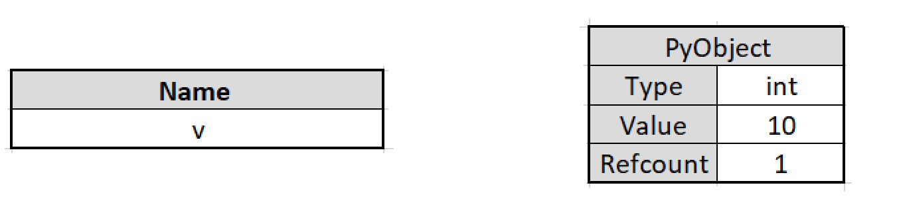
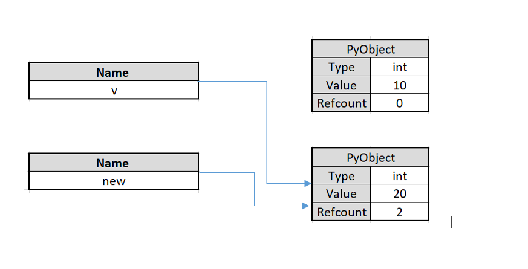
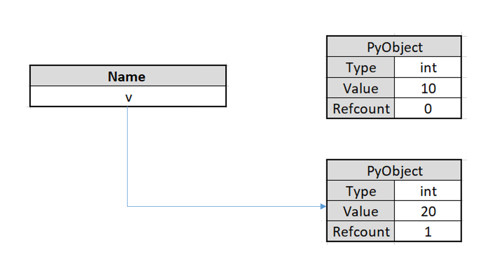

# Pointers in Python

Have you worked on programming languages like C++ or C? If yes, you would have definitely come across the term pointers. Every variable has a corresponding memory location and every memory location has a corresponding address defined for it. Pointers store the address of other variables. Surprisingly, pointers don&#39;t really exist in Python. If that is the case, what are we discussing here?

As you are aware, everything is an object in Python. In this article, we will look at the object model of Python and see how we can fake a pointer behavior in Python.

# Table of Contents:

You can skip to any specific section using the table of contents below.

- Why Don&#39;t Pointers Exist in Python?
- Variables in C vs Variables in Python
- Pointer Behavior in Python
- Pointers Using ctypes

# Why Don&#39;t Pointers Exist in Python?

Nobody knows why pointers don&#39;t exist in Python. Yes, the reason is unknown. Even in basic programming languages like C and C++, pointers are considered complex. This complexity is against the Zen of Python and this could be the reason why Python doesn&#39;t speak about pointers.

The objective of python is to keep things simple. Though the concept of pointers is alien to Python, the same objective can be met with the help of objects. Before we discuss further on this, let us first understand the role of objects in Python.

## What are Objects?

Everything is an object in Python. If you are just getting started with Python, use any REPL and explore the isinstance() to understand the same.

```
print(isinstance(int, object))
print(isinstance(str, object))
print(isinstance(list, object))
print(isinstance(bool, object))
```

Output:

```
True
True
True
True
```
As shown in the above output, everything in Python is an object. An object comprises of three parts:

- Reference count
- Type
- Value

Reference count is the number of variables that refer to a particular memory location.

Type refers to the object type and can be int, float, string, Boolean, etc.

Value is the actual value of the object that is stored in the memory.

Objects in Python are of two types – Immutable and Mutable. It is important to understand the difference between immutable and mutable objects to implement pointer behavior in Python. Let&#39;s first segregate the data types in Python into immutable and mutable objects.


| **Immutable** | **Mutable** |
| :---: | :---: |
| int | list |
| float | set |
| str | dict |
| bool |
| complex |
| tuple |
| Frozenset |

 
Immutable objects cannot be changed post creation. In the above table, you can see that data types that are commonly used in Python are all immutable objects. Let&#39;s look at the below example.

```
x = 34
y = id(x)
print(y)
```

When you run this script in your REPL environment, you will get the memory address of value.

Output:

```
94562650443584
```

Now, let&#39;s modify the value of x and see what happens. The value of x in the memory 94562650443584 is 34 and that cannot be changed. If we alter the value of x, it will create a new object.

```
x = 34
y = id(x)
print(y)
x += 1
y= id(x)
print(y)
```
Output:

```
94169658712736
```
```
94169658712768
```
Use the is() to verify if two objects share the same memory address. Let&#39;s look at an example.

```
x = y
x is y
```

If the output is true, it indicates that x and y share the same memory address.

Mutable objects can be edited even after creation. Unlike in immutable objects, no new object is created when a mutable object is modified. Let&#39;s use the list object that is a mutable object.

```
numbs = [1, 1, 2, 3, 5]
print("---------Before Modification------------")
print(id(numbs))
print()

## element modification
numbs[0] += 1
print("-----------After Element Modification-------------")
print(id(numbs))
print()
```

Output:

```
---------Before Modification------------
140469873815424
```

```
-----------After Element Modification-------------
140469873815424
```

Note that the address of the object remains the same even after performing an operation on the list. This happens because list is a mutable object. The same applies to other mutable objects like dict or set mentioned in the above table.

Now that we have understood the difference between mutable and immutable objects, let us look at Python&#39;s object model.

# Variables in C vs Variables in Python

Variables in Python are very different from those in C or C++. Python doesn&#39;t have variables. In Python, they are called names. To understand how variables in Python differ from that in fundamental programming languages like C and C++, let&#39;s look at the below example.

Let&#39;s define a variable in C.

```
int v = 10;
```

What does the above code execute? This single line of code executes the following:

- Allocates a memory for the defined data type, which in this case is int
- Allocates a value 10 to the memory location, say 0x5f3
- Indicates that the variable v takes the value 10

In C, if you want to change the value of v at a later point, you can do this.

```
int v = 20;
```

Now, the value 20 is allocated to the memory location 0x5f3. Since the variable v is a mutable object, the location of the variable did not change though the value of it changed. That is, the v here is not just the name of the variable but also its memory location.

Now, let&#39;s assign the value of v to a new variable.

```
int new = v;
```

A new variable new is now created with the value 20 but this variable will have its own memory location and will not take the memory location of the variable whose value it copied. In Python, names work in a contrasting way than what we just saw.

Let&#39;s rewrite the Python equivalent of the above code.

```
v = 10 
```

This line of code executes the following:

- Creates a new PyObject
- Sets the data type for the PyObject as integer
- Assigns a value 10 to the PyObject
- Creates a name v
- Points v to the newly created PyObject
- Increases the refcount of the newly created PyObject by 1

Let&#39;s visualize and make our understanding simple.




Unlike in C, a new object is created and that objects owns the memory location of the variable. The name defined v, does now own any memory location. Now let&#39;s assign a different value to v.

```
int v = 20
```

Let&#39;s see what happens here:

- Creates a new PyObject
- Sets the data type for the PyObject as integer
- Assigns a value 20 to the PyObject
- Points v to the newly created PyObject
- Increases the refcount of the newly created PyObject by 1
- Decreases the refcount of the already existing PyObject by 1



The variable name v now points to the newly created object. The first object which had a value 10 now has a refcount equal to zero. This will be cleaned by the garbage collector.

Let&#39;s now assign the value of v to a new variable.

```
int new = v
```

In Python, this creates a new name and not a new object.



You can validate this by using the below script.

```
new is x
```

The output will be true. Note that _new_ is still an immutable object. You can perform any operation on _new_ and it will create a new object.

# Pointer Behavior in Python

Now that we have a fair understanding of what mutable objects are let us see how we can use this object behavior to simulate pointers in Python. We will also discuss how we can use custom Python objects.

## Using Mutable Object:

We can treat mutable objects like pointers. Let&#39;s see how to replicate the below C code in Python.

```
#include <stdio.h>

void add(int *a)
{
  *a += 10;
}

void main() 
{
	int v = 10;
	printf("%d\n", v);
	add(&v); // to extract the address of the variable
	printf("%d\n", v);
}
```

In the above code, _ **v** _ is assigned with a value 10. The current value is printed and then the value of _ **v** _ is increased by 10 before printing the new value. The output of this code would be:

```
v = 10
v = 20
```

Let&#39;s duplicate this behavior in Python using a mutable object. We will use a list and modify the first element of the list.

```
def add(v):
v[0] += 1
new = [10]
add(v)
v[0]
```

Output:

```
20
```

Here, add() increments the first elements value by one. So, does this mean pointers are present in Python? No! This was possible because we used a mutable type, list. Try the same code using tuple. You will get an error.

```
new = (10,)
add(new)
```

Output:

```
Traceback (most recent call last):
  File "<stdin>", line 1, in <module>
  File "<stdin>", line 2, in add_one
TypeError: 'tuple' object does not support item assignment
```

This is because tuple is an immutable type. Try using other mutable objects to get similar desired output. It is important to understand that we are only faking pointer behavior using mutable objects.

# Pointers Using ctypes

We can create real pointers in Python using the built in ctype modules. To start, store your functions that use pointers in a **.c** file and compile it.

Write the below function into your **.c** file.

```
void add(int *a)
{
    *a += 10;
}
```

Assume our file name is **pointers.c**. Run the below commands.

```
$ gcc -c -Wall -Werror -fpic pointers.c
$ gcc -shared -o libpointers.so pointers.o
```

In the first command, **pointers.c** is compiled to an object **pointers.o**. Then, this object file is taken to produce **libpointers.so** to work with _ctypes_.

```
import ctypes

## libpointers.so must be present in the same directory as this program
lib = ctypes.CDLL("./libpointers.so")
lib.pointers
```

Output:

```
<_FuncPtr object at 0x7f23bf4e3561>
```

**ctypes.CDLL**  returns the shared object  **libpointers.so**. Let us define **add()** function in the  **libinc.so**  shared object. We have to use ctypes to pass a pointer to the functions defined in a shared object.

```
add = lib.pointers
## define argtypes
add.argtypes = [ctypes.POINTER(ctypes.c\_add)]
```

We will get an error if we try calling this function using a different type.

```
add(10)
```

Output:

```
Traceback (most recent call last):
File "<stdin>", line 1, in <module>
ctypes.ArgumentError: argument 1: <class 'TypeError'>: expected LP_c_int instance instead of in
```

The error states that a pointer is required by the function. You must use a C variable in ctypes to pass the variable reference.

```
v = ctypes.c_add(10)
add(ctypes.byref(v))
v
```

Here _ **v** _ is the C variable and _ **byref** _ passes the variable reference.

Output:

```
c_add(20)
```

# Conclusion

As we saw in this tutorial, pointer behavior can be implemented in Python though they are technically not available. While we used mutable objects to simulate pointer behavior, the ctype pointers are real pointers.