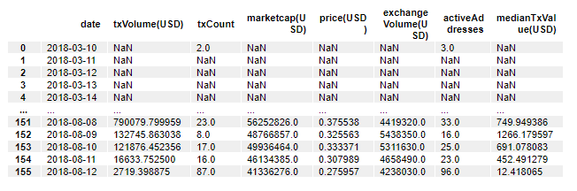
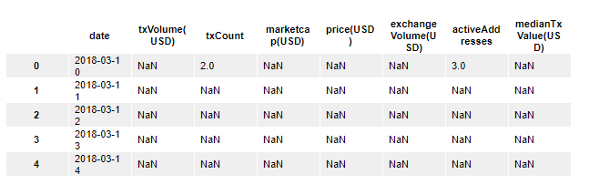
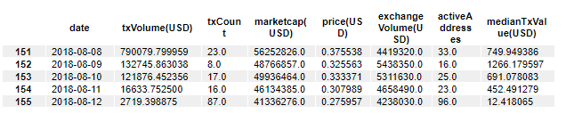
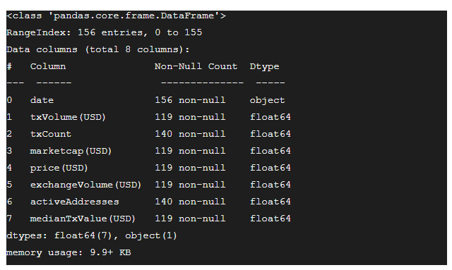
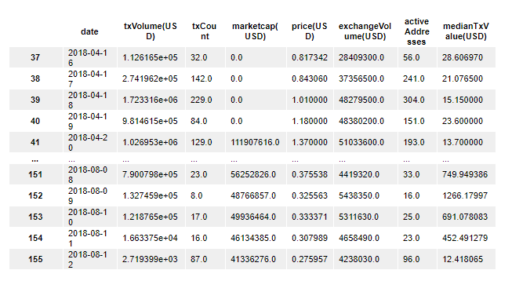
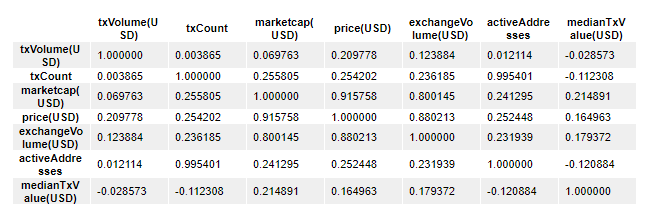

# What is Exploratory Data Analysis?

  

## What is Exploratory Data Analysis (EDA)?
    

Exploratory data analysis (EDA) is a course of action that is taken to analyze a data set in order to assess its nature and its characteristics usually with the involvement of visualization techniques. The fundamental aim of the exploratory data analysis is to draw information out of the data set that can be useful for applications beyond the usual assumption testing and model designing. EDAs can be really useful in further hypothesizing the data set and what it can potentially unveil in order to make the analysis more resourceful and constructive.

The specific objectives of the EDA can be identified as understanding distribution of the dataset, identifying potential patterns and trends, identifying the outliers or anomalies, producing a hypothesis, validating assumptions, and producing a visually-summarized representation of the dataset.

## Why is EDA Important?
    

Although many tend to skip this, exploratory data analysis is considered to be an essential step in any project or development related to data analysis as it is one way of analytically knowing if the model based on the data will be sound, well defined, and scoped within the boundaries of the intended application in order to produce the desired outcomes. EDA helps to find anomalies in the data, its errors, noise, loss of data, and its validity with respect to the application. Therefore, performing an EDA on the dataset can really be useful in many ways such as its readiness to be used in modeling a scenario, ways to determine the best-suited algorithm, finding new data patterns, and even defining which variables are dependent and independent.

Following a proper exploratory data analysis can save one’s troubles from building invalid or erroneous models, building models on unsuitable data, selecting unsuitable variables, and even unoptimized development of the model. In addition to being an approach to pre-quip the study with information to perform better analysis and develop a better model, EDA can be helpful in preparing data for the model as well.

## Methods to Perform EDA
    

There are many methods that can be used to perform exploratory data analysis. However, as with everything else, it is also considered that performing EDAs using various types of methods and comparing often produces better results than just performing one EDA and sticking to it. There are also possibilities of having to acquire data again as the available or collected dataset is not adequate or suitable for the intended task. The aim of EDA solely is to ensure that the dataset aligns with the model that is to be developed. The following are a few methods available in performing exploratory data analyses.

### Univariate Visualization
    

This method can be used to produce a statistical summary for each separate column of the unprocessed dataset.

### Bivariate Visualization
    

This method is used to determine the connection between each independent variable and the intended dependent variable.

### Multivariate Visualization 
    

This method can be used to understand the relationship between different columns of the dataset.

### Dimensionality Reduction
    

In simple terms, dimensionality reduction can be used to reduce the number of dimensions in a dataset and transform to another dimensional space that is lower than the original while still sustaining the meaningful and resourceful characteristics of the dataset.

These methods can be used to develop questions that can be answered by modeling or to develop a sense of how the results of this model should be interpreted. The usual procedure to perform exploratory data analysis in your code is as follows.

1.  Acquire a suitable dataset and import it
    
2.  Understand the nature of the dataset by observing data from different rows.
    
3.  Try to further understand the nature of the dataset by querying the data
    
4.  Identify if there are any missing values
    
5.  Try to comprehend the features of the dataset from a data science standpoint
    
6.  Identify the difficulties of working with the dataset due to its missing and extreme values.
    
7.  Identify any potential patterns even if they cannot be explained right away
    

This process is often encompassed by a step called data profiling. Data profiling is performed on top of summarizing the dataset using visualization and statistics to facilitate further comprehending the dataset. Based on the outcome of data profiling, the next steps can be decided regarding the dataset whether or not to rectify or reject depending on the suitability to the potential machine learning model.

We will now put everything we have learned to practice.

  

## A Simple EDA Exercise in Python
    

We will now get started with getting ourselves familiar with the basics of exploratory data analysis by practicing on a dataset. We will be using the [Cortex cryptocurrency dataset](https://datahub.io/cryptocurrency/cortex) in this exercise. We will be requiring the following libraries as a prerequisite. We will first get an idea about them.

-   Pandas
    

Pandas is a highly optimized Python library written for manipulation and analysis of data.

-   NumPy
    

NumPy is one of the most versatile libraries intended towards mathematical and numerical computations on matrices of various dimensions.

-   Matplotlib
    

Matplotlib is a Python library that is written for the visualization of data.

-   Seaborn
    

Seaborn is a library that is based on Matplotlib and it helps to make visualizations of data easier.

  

We will now install the above libraries using pip.

`pip install pandas`

  

`pip install numpy`

  

`pip install matplotlib`

  

`pip install seaborn`

  

Additionally, we also require datapackage library to be installed as we are directly importing data through a remote server.

`pip install datapackage`

  
  

We are all set now. Let us import the dataset.

  
```python
import pandas as pd
import datapackage
remote_url = 'https://datahub.io/cryptocurrency/cortex/datapackage.json'
my_pkg = datapackage.Package(remote_url)
my_rsc = my_pkg.resources
for rsc in my_rsc:
	if rsc.tabular:
		df = pd.read_csv(rsc.descriptor['path'])
df
```
  

It will output the data as follows.



  

If we look at the fields, we will see that there are 8 columns in addition to the index column. For this exercise, we are not required to know each column and what it denotes. Consider them as variables and we will get familiar with any specific ones as we go.

If we are to take a look at the shape of the data, we can easily run the following to get the number of columns and rows.

`df.shape`
  

Output:

    (156, 8)

  

This means the above dataset has 156 observations and 8 characteristics.

In addition to that, by running the following, we can observe the first five rows and the last five rows from the dataset.

`df.head()`



`df.tail()`


As we noticed in the first five observations, there could be more null values in this dataset that are denoted by NaN in this pandas dataframe.

`df.info()`

  

Output:



  
  

According to the above, we can understand that except for the date field, all the other fields have float values. Moreover, except for in the date column, every other field has NaN values. At this point we can either go ahead with the existing table, replace the NaN values with another value, or discard all the observations that have NaN values. In this scenario, let’s choose the last option and drop all the observations with NaN fields.
```python
df = df.dropna()
df
```
  

Output:



`df.shape`

Output:

    (119, 8)

Now that we've dropped some of the observations, we can see that there are only 119 observations left out of the 156 there were initially. It can also be seen that the indices start from 37 and have lost their consistency. We will reset the indices using a pandas function as follows.

`df = df.reset_index(drop=True)`

  

This would have reset the indices of the dataframe. We are passing a`drop=True` argument because we do not require the old indices in the new dataframe as another column.

We can now use the `pandas.describe()` function to look at a summary of all the fields such as their means, percentiles, standard deviation, min, max, etc.

`df.describe()`


If the parameter you are looking for is the median, it can be seen from the 50th percentile. If we are to make some observations from the above, we can see that the difference between the 50th percentile and the 75th percentile of txCount field is much greater than the difference between the 25<sup>th</sup> percentile and the 50<sup>th</sup>  percentile. Dataset also exposes similar characteristics to some of the other fields. We can also observe that in the same columns, the mean is significantly higher than its median. Both these observations suggest that there are outliers in the dataset.

Provided that this dataset had lots of similar values or repeated values, we could have used the unique() function to observe all the unique values that are existing in a field. In addition to that, using the `value_counts()` function, the number of times each value in a column has occurred could have been observed as well.

Take your own time and try to observe any more characteristics or patterns in this dataset. There could be hundreds of different patterns that are just waiting to be unveiled or noticed. Therefore, take your time with it.

Now that we are a bit familiar with the nature of this dataset, we can produce the correlation matrix for this dataset using the `corr()` function. Correlation matrices are highly useful in summarizing massive amounts of data and to identify patterns among the different fields. It also allows us to perform diagnostics to find if some variables are extremely correlated to another suggesting that some types of modelling such as linear regressions would produce unreliable predictions.

`df.corr()`

  

Output:




  
  

We can also use the Seaborn library we installed earlier and perform some visualization as follows to further comprehend the correlation matrix in a more appealing way.
```python
import seaborn as sns
import matplotlib.pyplot as plt
sns.heatmap(df.corr(), annot=True)
plt.show()
```
  


  
  

Using this correlation matrix, we can infer that txCount has a very strong positive correlation with activeAddresses. If we consider what txCount is, it is a field that denotes the number of blockchain transactions that are occurring. The field activeAddresses denotes the number of individual addresses that are engaging in the transactions. There are many more such patterns left in this and feel free to infer more of them as it will help you to develop your data analysis skills.

We can also take a look at how the price has changed over the available dates. Prior to doing that, let us see if there are any duplicate dates. As we already know that there are 119 observations, we can produce the array consisting of unique values in the date field and find its length as follows.

  

`len(df['date'].unique())`

  

Output:

    119

  

Now that we know all dates are unique and that the dates are in chronological order even with the NaN values dropped, we can produce a scatter plot using matplotlib as follows to see how the prices have changed over the months.
```python
import matplotlib.pyplot as plt
plt.scatter(df['date'],df['price(USD)'])
plt.xlabel('Timeline')
plt.ylabel('Price')
plt.show()
```
  
  


We can also produce a scatter plot that shows how the number of active addresses has varied over the months.

  
```python
import matplotlib.pyplot as plt
plt.scatter(df['date'],df['activeAddresses'])
plt.xlabel('Active Addresses')
plt.ylabel('Price')
plt.show()
```
  


From the description we produced earlier we know that the mean for active addresses is approximately 204. We also observed that on some dates, there are numbers as high as 4270 and numbers as low as 16. Considering the above chart, we can further observe those outliers in a visual way. As there are more patterns that can be observed the same way, feel free to produce more plots involving other fields that might be useful in inferring important information in this exploratory data analysis step.

  

## Conclusion
    

Exploratory data analysis is a way to summarize and analyze data involving techniques such as tabulation and visualization. Involving EDAs in one's statistical modeling can be extremely useful in determining the best-suited model for the intended machine learning model. Moreover, it also helps in identifying unseen trends and patterns in the dataset that might be constructive or destructive to the application. Although EDAs can be seen as a redundant process, it can and will be very resourceful to take necessary steps in avoiding waste of time and computational resources due to bad selections of datasets and models that might often lead to the rebuilding of the whole model.
