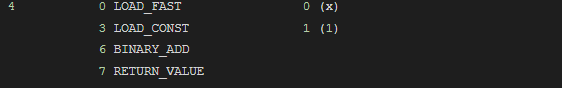


# Python Lambda Functions

Python is one of the most versatile languages available. Many programming languages today are becoming more and more Pythonic due to this flexibility and versatility. Lambda functions are one of the features that are being cherished by other languages which make programming smarter and much more efficient. Lambda functions are also called anonymous functions or function literals. They also may or may not be explicitly pointed by a variable or be named.

Before we dive into more details, let's take a look at what Lambda functions are and how they compare with regular functions in structure.

## Quick Look into Regular vs Lambda Functions

If we consider a regular function, this is how it would look like.

```python
def  add_one(x):
	return x+1
```
This function would take one argument and would add 1 to it and return. If we run `add_one(2)` it would return 3.

Let’s see how we can write the same with a lambda function.

lambda arguments : body
```python
lambda  x:x+1
```
If we look at the above, it has the lambda keyword, an argument(or could have multiple arguments), and the body of the function.

However, if we are to run this, we have to encapsulate the whole statement with parenthesis and pass an argument as follows.
```python
(lambda  x:x+1)(2)
```
If we run the above, it will return 3.

You must be wondering how you would use a lambda function elsewhere in the code without having to explicitly write it there.

There are three ways to do that. We will go over them one by one.

### Use the underscore (Does not if for Python modules)

This method is not encouraged to be used. However, if you are using the Python shell or a Jupyter Notebook, the underscore will point to the last lambda expression that is defined.
```python
lambda  x:x+1
_(2)
```
If the above code is run, it will return 3. Since this does not work with modules, there are two more ways that can be considered to call a lambda function.

### Naming the lambda function

Instead of writing `lambda x:x+1` anonymously, it can be named.
```python
my_func = lambda  x:x+1
```
  

Now you can call the following anywhere in the code and use the lambda function.

`my_func(2)`

This will return 3 as the output.

### Having the lambda function inside a regular function

This is the most common way of using lambda functions. Some larger regular functions require code snippets which are not significant enough to be defined as a separate function explicitly. In circumstances like these, lambda functions can be used.
```python
def  square_func(a):
	#do some operations here
	return (lambda  x : x*x)(a)
```
If we run `square_func(2)`, it will return 4.

It should also be noted that the above function is only made simple for demonstration purposes. In order for a lambda function to be embedded in regular functions, they are expected to be more complex in practice.

That was a quick look into Python lambda functions
## Lambda Functions – Examples

In this section, we will take a look at a few more examples of using lambda functions.

### Multiple Arguments with Lambda Functions

If we go over the syntax of a lambda function, it is as follows.

    lambda arguments : body

If only one argument is present,
```python
lambda  x:x+1
```
Let us write a lambda function to add two numbers together.
```python
add_numbers = lambda  x,y : x+y
add_numbers(2,4)
```
If this is run, it will return 6.

### Returning Lambda Functions as Objects

Let us consider user-defined multiplier objects for doubling, tripling, and quadrupling values.

We can first write a function to return a lambda function with the required multiplier embedded.
```python
def  multiply_by(n):
	return  lambda  x : x*n
```
  

Now we can create multiplier objects as follows.
```python
value_doubler = multiply_by(2)
value_tripler = multiply_by(3)
value_quadrupler = multiply_by(4)
```
Now we can use our multiplier objects to work.

`value_doubler(5)`

`value_tripler(5)` 

`value_quadrupler(5)`

If the above are run one by one, they will return 10, 15, and 20.

### Passing Functions as Arguments into Lambda Functions

Let us define a few lambda functions to perform operations such as add one, subtract one, and square.
```python
add_one = lambda  x:x+1
subtract_one = lambda  x:x-1
get_square = lambda  x:x*x
```
A function that takes in another function as an argument can be called higher-order functions. We can write a higher-order function to get a result by inputting the function as follows.
```python
get_result = lambda  x, func : func(x)
```
Then we can run the function as below by running the following separately.
```python
get_result(4, add_one)
get_result(4, subtract_one)
get_result(4, get_square)
```
Each would output 5, 3, 16 respectively.

The above are the most common ways of using lambda functions. All the other usages are either combinations or derivatives of these.

## A Deeper Look into Regular vs Lambda Functions

Regular functions somewhat take more lines of code than a lambda function. However, as developers or programmers, one should be aware of the underlying mechanisms or the extreme cases of using one over the other. The following is a comparison made between a few key aspects of both these function types.

### Syntax

We already know the structure of both regular and lambda functions.
```python
def  add_one(x):
	return x+1
```
    lambda arguments : body

```python
lambda  x:x+1
```
As it can be seen, the lambda structure has a few distinctive features. For starters, it is written as a single line with expressions. They also can be immediately called then and there, unlike regular functions. Let us go over these, one by one.

#### Single Line
```python
(lambda  x :
'Positive'  if x>0  else  'Zero or Negative')(5)
```
A lambda function is Python contains a single line with an expression in its body. Although while writing the lambda function, it can span over multiple lines. However, since there is only one expression. it theoretically is a one-liner function.

Moreover, a single expression does also mean that there can be no statements. Statements are lines of code that execute instructions to perform an action. Expressions are lines of code that evaluate to a value. Let us try to perform a simple instruction.
```python
y = 10
(lambda  x: y=x )(5)
```
  

In this, we are trying to change the value of y to 5. However, running this returns a `SyntaxError: invalid syntax`.

#### Immediately Invoked Function Expression

IIFE is a type of function that executes as soon as they are defined. Lambda functions can be immediately invoked as soon as they are defined, unlike regular functions. This is also why lambda functions are sometimes called anonymous functions or expressions.

### Argument Passing

In terms of argument passing, lambda functions function the same way regular functions do. They do support both positional, named, and default arguments. Furthermore, they also support both keyworded and non-keyworded variable lists.

The following are examples of using them with lambda functions.

#### Positional Arguments
```python
(lambda  x,y: x+y)(5,10)
```
#### Keyword Arguments
```python
(lambda  x,y: x+y)(x=5,y=10)
```
  

#### Default Arguments
```python
(lambda  x=5,y=10: x+y)()
(lambda  x,y=10: x+y)(5)
```
#### *args

These arguments are used to pass a varying number of arguments into a function.
```python
(lambda *args: sum(args))(5, 10, 15, 20)
```
#### **kwargs

These are used to pass a varying number of keyworded arguments into a function.
```python
(lambda **kwargs: sum(kwargs.values()))(x=5, y=10, z=15)
```
### Functionality of the Interpreter

The underlying functionality of the functions at the face of the interpreter plays a huge role in the execution times functions consume. Therefore, as a developer, one should be aware of it to present the most optimized code.

This can be achieved by using the ‘dis module’, the disassembler for Python bytecode.

Let us take a look at the bytecode of a regular function.
```python
import dis
def  add_one(x):
	return x+1
	dis.dis(add_one)
```

We would get the outcome as,



 These are the set of instructions the Python interpreter uses to perform the task.

Let us look at the bytecode of a lambda function which does the same task.
```python
import dis
dis.dis( lambda  x : x+1)
```
Output:


Bytecodes of both functions are identical. This leads us to the conclusion that in spite of how different syntaxes of the functions, their underlying functionality, and the mechanisms are alike.

### Traceback (in Exceptions)

Let us write a regular function to add an integer to a string
```python
def  add_string(x):
	return x+''
```
If we try to execute add_string(10), it will throw TypeError: unsupported operand types.

Its traceback would be

    File "<stdin>", line 1, in <module> 
    File "<stdin>", line 2, in add_string

If you use an IPython shell or a notebook, it would give the following error.

    <ipython-input-xx-xxxxx> in add_string(x)

Let us do the same with a lambda function.
```python
add_string = lambda  x : x+''

add_string(10)
```
This would throw the same error. However, its traceback would say

    File "<stdin>", line 1, in <module>
    File "<stdin>", line 1, in <lambda>

If you use an IPython shell or a notebook, it would give the following error.

    < ipython-input-xx-xxxxx > in <lambda>(x) .
    
It is visible that although both functions were named, in the traceback of the lambda function, it explicitly mentions lambda instead of the function name. Therefore, when it comes to tracing back errors, the usage of regular functions would be much more exact unlike with lambda functions.

### Decorators

Functions in Python are objects. They can be passed as arguments and returned from functions. Decorators in Python enable the functionality of modifying the behavior of a function. We can wrap a function with another and temporarily modify its behavior.

Let us define a simple decorator function and a decorated function.
```python
def  func_1(f):
	def  dec(*args):
		print('Decorator')
		return f(args)
	return dec
@func_1
def  func_2(num):
	return  'This is the decorated function: ' + str(num)
```

In this, `func_1` is the decorator and `func_2` is the decorated function. It can be identified by the @func_1. The above is equivalent to the following.
```python
def  func_1(f):
	def  dec(*args):
		print('Decorator')
		return f(args)
	return dec
def  func_2(num):
	return  'This is the decorated function: ' + str(num)
func_2 = func_1(func_2)
```
If we run func_2(10), if would output,

    Decorator
    'This is the decorated function: (10,)'

Let us do the same for a lambda function. However, note that it is not supported to @func_1 before a lambda function. Therefore, the right way is to define both the decorator and the lambda function and pass the lambda function into the decorated function.
```python
def  func_1(f):
	def  dec(*args):
		print('Decorator')
		return f(args)
	return dec
func_2 = lambda  num :'This is the decorated function: ' + str(num)
```
Now that we have both functions defined, let us run it.

`func_1(func_2)(10)`

Note that the argument for the lambda function is outside the decorated function.

Output:

    Decorator
    'This is the decorated function: (10,)'

### Closures

A closure in Python is a functional object that can be used to sustain values in nested scopes.

Let us try to understand how closures work in regular functions. Consider the following nested function.
```python
def  func_1(x):
	x=x*2
	def  func_2(y):
		print('x = ' +str(x)+' y = '+str(y))
		return x + y
	return func_2
for i in  range(3):
	func_3 = func_1(i)
	print('func_3('+str(i) + ') = '+str(func_3(i)))
	print()
```
  

For this code, output is,

    x = 0 y = 0
    func_3(0) = 0    
    x = 2 y = 1    
    func_3(1) = 3    
    x = 4 y = 2    
    func_3(2) = 6  

It is understandable that although calling of func_3(i) has no whatsoever connection it its previous iteration in the for loop. However, the value of y has access to its lasting value from its previous scope. This is a phenomenon induced by the closure.

Let us try to do the same with lambda function.
```python
def  func_1(x):
	x=x*2
	return  lambda  y: x+y
for i in  range(3):
	func_3 = func_1(i)
	print('func_3('+str(i) + ') = '+str(func_3(i)))
```
This would result in the following.

    func_3(0) = 0
    func_3(1) = 3    
    func_3(2) = 6

This would result in the same output as func_3(i) in the regular function example. This means the lambda function behaves the same way as a regular function does.

### Code Testing

Code testing such as unit testing is used to test how the code functions. These usually come in handy when codes are refactored. unittest and doctest are two of the most common libraries used for Python testing. Usually, test cases are written for all functions and asserted.

Let us see how the unittest module works with regular functions.
```python
import unittest
def  add_num(a,b):
	return a+b
class  TestSum(unittest.TestCase):
	def  test_sum(self):
		self.assertEqual(6, add_num(3,3) )
if  __name__ == '__main__':
	unittest.main(argv=['first-arg-is-ignored'], exit=False)
```

Let us see how this is written for lambda functions.
```python
import unittest
add_num = lambda  a,b: a+b
class  TestSum(unittest.TestCase):
	def  test_sum(self):
		self.assertEqual(6, add_num(3,3) )
if  __name__ == '__main__':
	unittest.main(argv=['first-arg-is-ignored'], exit=False)
```
For both these tests, the output is

----------------------------------------------------------------------
    Ran 1 test in 0.000s  
    OK

The doctest module will also perform the same way for both lambda and regular functions.

## When to Use Lambda Functions

Lambda expressions are a topic of debate for developers. Some are for it and some are against it. Developers who are against back their facts with readability issues, breach of functional concept, and the syntactical issues.

However, lambda functions are considered to be mutually accepted in the following scenarios in the programming community.

### map() function
```python
sum_name = lambda  a,b: a+b
my_map = map(sum_name, ('Red', 'Blue', 'Green'), ('John', 'Freddie', 'Gunther'))
list(my_map)
```
Output:

    ['RedJohn', 'BlueFreddie', 'GreenGunther']

### filter() function
```python
marks = [51, 21, 78, 18, 81, 90]
my_filter = lambda  x: x if x>75  else  0
passed_students = filter(my_filter, marks)
list(passed_students)
```
Output:

    [78, 81, 90]

### Functions with key as a parameter – Ex: max(), min(), sort()
```python
student_num = ['2006/3281','2007/6234','2005/6384','2004/2341']
newest_student = max(student_num, key = lambda  x: int(x[:4]))
newest_student
```
Output:

    ‘2007/6234’

### timeit.timeit

`timeit` is useful in calculating how much time it takes for a task to be done.

Following is the usual syntax of timeit with its usage.  
```python
import timeit
import_statement = "from math import sqrt"
my_code = "sqrt(10000000)"
timeit.timeit(setup = import_statement
				stmt = my_code,
				number = 10000)
```

Output: (Will vary from device to device)

    0.0012792159977834672

However instead of this, we can use lambda functions as follows.
```python
import timeit
from math import sqrt
my_code = "sqrt(10000000)"
timeit.timeit(lambda : sqrt(10000000), number = 10000)
```
Output: (Will vary from device to device)

    0.0012739029856584966
    
### Other:

-   Mapping actions to events. Ex: UI events
    
-   Dynamic modifications of a class. Ex: Monkey Patching
    

## When to Avoid Using Lambda Functions

Lambda expressions are believed to be going against Python standards in the following cases. These are not necessarily about the code’s functionality but also about readability. Avoid using lambda expressions with the following as much as possible.

### Raising Exceptions
```python
def  custom_exception():
	raise  Exception('Throwing my exception')
(lambda: custom_exception())()
```
 
Output:

    Traceback (most recent call last):
    File "xxx.py", line 3, in <module>    
	    (lambda: custom_exception())()    
    File "xxx.py", line 3, in <lambda>    
		(lambda: custom_exception())()    
    File "xxx.py", line 2, in custom_exception    
	    raise Exception('Throwing my exception')    
    Exception: Throwing my exception

  

Although the code seems to be functioning, it is advised to use regular functions in this scenario.

### Using Underscore in Lambda

Underscores in Python are used to reference throwaway variables. Lambda functions are already bringing in a bit of obscurity to the code and adding an underscore in the lambda function would only worsen it.

### Class Methods

It should also be avoided writing lambda for class methods in Python. Although the interpreter has no issue with this, it is considered a bad practice.

## Map Filter Reduce Instead of Lambda Functions

It is already our understanding that lambda expressions are not the favorite of every developer. Some are for it and some are against it. This is why it is best to be knowledgeable about other functions that can be used instead of lambda expressions in some cases.

### map()

Simply, the map() is a function that executes another function individually for each item in and returns the output as an iterable.
```python
def  sum_name(a, b):
	return a+b
my_map = map(sum_name, ('Red', 'Blue', 'Green'), ('John', 'Freddie', 'Gunther'))
list(my_map)
```
Output:

    ['RedJohn', 'BlueFreddie', 'GreenGunther']

### filter()

This function returns an iterable object after filtering through a function of choice.
```python
marks = [51, 21, 78, 18, 81, 90]
def  my_filter(x):
	if x > 75:
		return x
passed_students = filter(my_filter, marks)
list(passed_students)
```

Output:

    [78, 81, 90]

### reduce()

Syntax of reduce() is reduce(function, sequence) which is similar to both map() and filter(). The functionality of reduce() is as follows.

The first two objects of the sequence are considered and input to the function to obtain a result. Then that result and the next object in the sequence are considered and input to the function to obtain the next result. This is continued until all objects in the sequence are processed.

The following is a simple example

  
```python
import functools
my_list = [1,2,3,4,5,6]
def  adder(x,y):
	return x+y
functools.reduce(adder,my_list)
```
 
Output:

    21

## Conclusion

Lambda functions are a great way to write anonymous functions and also to avoid the use of unnecessary lines. They are very effective and a clever way to optimize the code as well. In spite of its flexibility, they are a topic of debate. This is mainly because the readability of code is as much important as how optimized the code is.

Lambda functions have been in Python [since 1994](https://en.wikipedia.org/wiki/History_of_Python#Version_1) and are perfectly Pythonic. If a developer is concerned about keeping the code short, lambda functions will definitely come in handy. However, it is always best to only use lambda functions the way they are intended to by the community and the standards.


